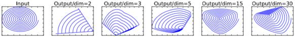
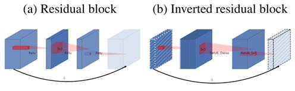

# MobileNets
*(Not finished yet)*

## V1
*MobileNets: Efficient Convolutional Neural Networks for Mobile Vision Applications*

MobileNet小和快的特性均由新的卷积方式来实现：Depthwise + Pointwise 替代了标准的卷积。

文中有段话：“Often convolutions are implemented by a GEMM but require an initial reordering in memory called im2col in order to map it to a GEMM. …… 1×1 convolutions do not require this reordering in memory and can be implemented directly with GEMM which is one of the most optimized numerical linear algebra algorithms.”
大致是说1×1的卷积由于无需在内存中重新排序相较其他的卷积运算可以更快，GEMM则是一个快速矩阵乘法的前向加速思路。我翻了翻感觉是个大坑就先跳过，以后有空可以https://www.jianshu.com/p/26f24f464016 跟着实现一下，或者直接https://github.com/flame/blislab 以及arXiv上翻论文。
MobileNet采用了基于TensorFlow 的RMSprop算法进行训练。同时考虑到深度卷积的参数比较少，减少甚至取消了权重衰减/L2正则化以进一步缩小模型大小。
相比标准卷积运算，MobileNet的运算量下降8~9倍(选用3×3的卷积核)，而准确度仅下降1％。同时文章发现在保证运算量大致相当的情况下，统一减少每层的通道数(Width Multiplier)比粗暴地减少网络的层数效果要好，也即其后文分析的两个超参数宽度因子和分辨率因子。

## V2
*MobileNetV2: Inverted Residuals and Linear Bottlenecks*

Linear Bottlenecks，线性的瓶颈结构：即对于Bottleneck的最终输出，不使用ReLU6而是直接输出。文章中提到两点，其一，对于一个输出的非零值ReLU就相当于是线性变换，其二，ReLU能够保证输入信息不受损失的必要条件是：当且仅当输入数据在整个输入维度中属于某个子空间。在使用了MobileNetV1中的宽度因子进行缩减网络模型时，将特征集中在缩减后的通道里。但此时使用激活层ReLU将会有较大的信息损失(负元素置零)，因此选择使用线性输出。

显然维度越低对信息的损失就越大，ReLU对于负的输入值，输出为0，会造成信息的损失，导致特征被破坏。文中的实验也证实线性输出将比使用ReLU6提高0.5％的准确度。
Inverted Residual block，逆向的残差结构：在ResNet和ShuffleNet中，Bottleneck均是“压缩→卷积获得特征→扩展”的策略，而在MobileNetV2中则选择了“扩展→卷积获得特征→压缩”的策略，也就是说Invert的是Bottleneck的结构。

从示意图中可以看到：1. Residual block结构没有被Invert(黑色箭头)，改变的是Bottleneck(明显变成了先升维后降维)；2. Bottleneck中间仍然保持着Depthwise Convolution和ReLU6的过程，但两次Pointwise Convolution的输出后面没有ReLU之类的激活函数了。
考虑到压缩后卷积能够提取的特征相对会减少， MobileNetV2反其道而行，先扩张后压缩，这样差不多又提高了0.5％的准确度。同时MobileNetV2还将压缩后的ReLU6取消以减少信息损失。

## V3