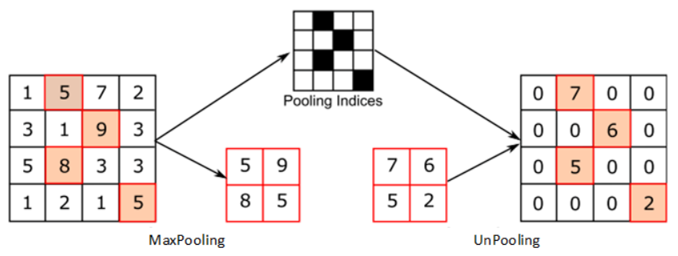
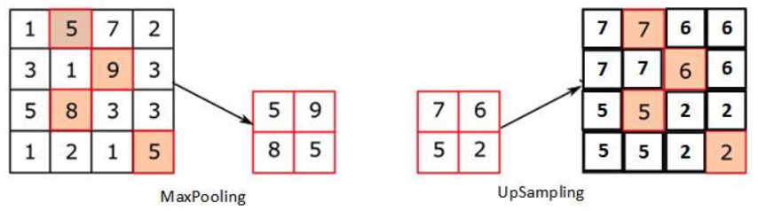
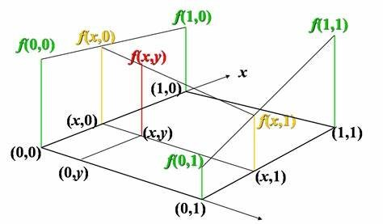
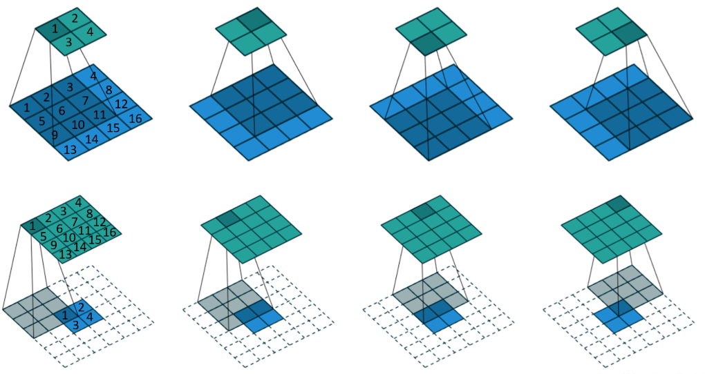
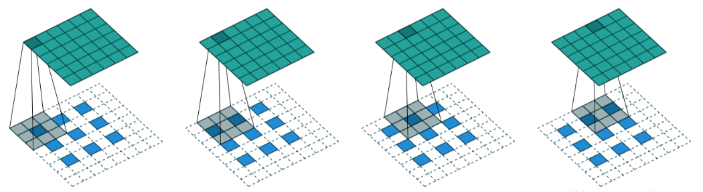
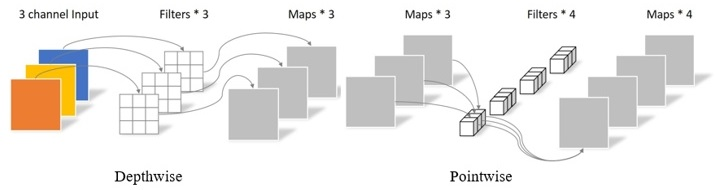

# Basic Operations

## 反池化(Unpooling)

- 通常指代Max pooling的逆过程，通过记录最大池化时最大值点的坐标将卷积等操作后的结果填回对应的位置，其余补零。

## 上采样(Upsampling)

1. 最近邻插值法，在待求像素的四相邻像素中，将距离最近点的值赋给待求像素，优点是计算开销小，缺点是锯齿状明显；

2.	双线性插值法，利用待求像素的四相邻像素在两个方向上进行三次线性插值以获取待求像素值，优点是图像连续，缺点是计算量大、图像轮廓可能模糊。

## 转置卷积(Transposed convolution)
- 也被称为反卷积(Deconvolution);
- 卷积的过程相当于输入数据和一个稀疏矩阵相乘，不妨记其前向传播过程为Y = CX。显然，其反向传播过程为∂Loss/∂X = C.T∂Loss/∂Y，也即C和C.T分别对应了前向和反向传播的过程。因此将使用C/C.T计算前向/反向的计算称为卷积，使用C.T/C计算前向/反向的计算称为转置卷积。和前两者相比，其不同的关键之处在于卷积核是可以学习的;
- 对于W1×W1大小的输入，使用K×K卷积核、P的补零和S的步长，则得到的输出尺寸应为：W2 = (W1-K+2P)/S+1，其对应的转置卷积输出也即：W1 = S(W2-1)-2P+K。

- 上图中的第一行是W1=4，K=3，P=0，S=1的普通卷积的过程，第二行则是其对应的转置卷积的计算过程，虚线框中均为零。在第一列中，输入元素1仅对输出元素1有贡献，因此在转置卷积的过程中，输出元素1也仅用到了输入元素1和补充的0。显然，有效卷积(Valid)和全卷积(Full)互为转置，而等大卷积(Same)的转置则是其本身。

- 当卷积的步长S不为1的时候，其转置卷积需要在输入元素之间添加额外的S-1个零，从而使得卷积核以比单位步幅慢的速率移动，也即分数步长卷积。需要注意的是被分隔的是输入数据元素而非卷积核，也即分数步长卷积和空洞卷积是不同的两种卷积方式;
- 在普通卷积中，若输入尺寸增加不超过步长S的值，其输出将不会发生变化，也即忽略了额外的输入。对于转置卷积，为了获得和原卷积输入相同大小的输出，需要在分数步长卷积的基础上增加额外的补零数a = W1-K-2P (mod S)，上图中的右侧和下侧均被添加了额外的0以体现6×6的输入，3×3的卷积，步长S=2时被忽略的最右和最下侧的数据。

## 深度可分离卷积(Separable convolution)

- Separable = Depthwise + Pointwise
- 深度可分离卷积在参数数量和运算数量上均远优于标准卷积，其关键之处在于标准卷积将原始数据向256个通道里各传递了一次，而深度可分离卷积仅在Depthwise时传递一次数据，然后在Pointwise里将数据拉伸到256个通道中;
- 深度可分离卷积也存在其自身的弊端，在过小的网络中，如此小规模的参数存在学不到特征的可能性，然而这往往可以通过扩大网络规模来解决;
- 使用1×1卷积核的卷积层，其基本作用为调节通道的数量，或者说调整数据的深度以平衡计算量和准确性。而且，在每个卷积层后被使用的激活函数将会增添网络的非线性，从而优化性能。1×1卷积核在增加网络深度和非线性时，增加的参数数量和计算量显然小于其他大小的卷积核。同时，它还拥有着最优化的底层卷积计算速度，因此它成为了很多网络的首选项。