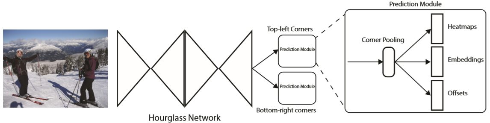

# Law, 2018, CornerNet

*CornerNet: Detecting Objects as Paired Keypoints*

## Forward

1. 预处理部分为一个nn.Conv2d(3, 128, 7, padding=3, stride=2)和一个Residual(128, 256, stride=2)残差块结构，上图中未画出；
2. Backbone选择了Hourglass Network，通过串联两个Hourglass模块组成；
3. 两个预测模块分别检测左上角和右下角，特征网络的输出经过Corner pooling后分别预测：
	a. Heatmaps：C×H×W，其中C表示目标类别(无背景类)，输出值为0~1，代表该点是角点的概率；
	b. Embeddings：1×H×W，代表该点可能属于的角点组别；
	c. Offsets：2×H×W，代表从Heatmaps映射回原图时的量化误差。

## Backward

## Post-processing