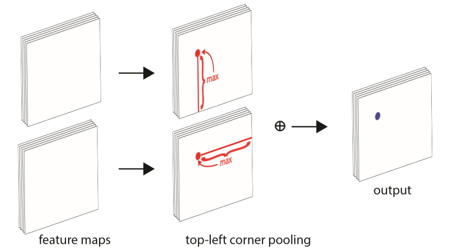
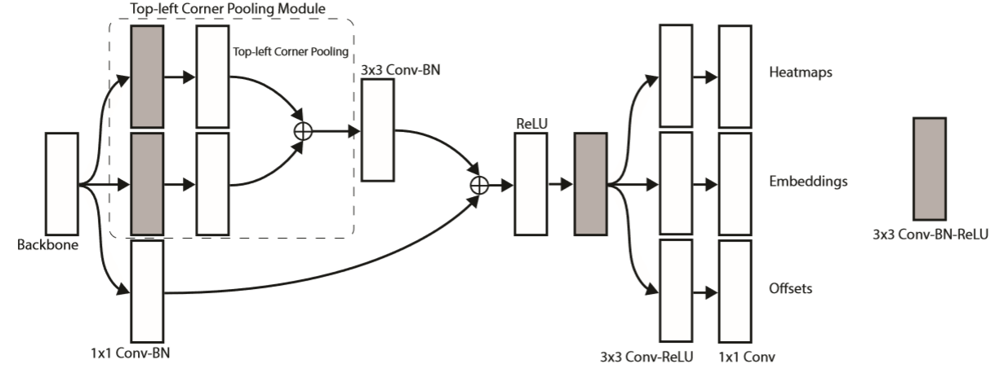
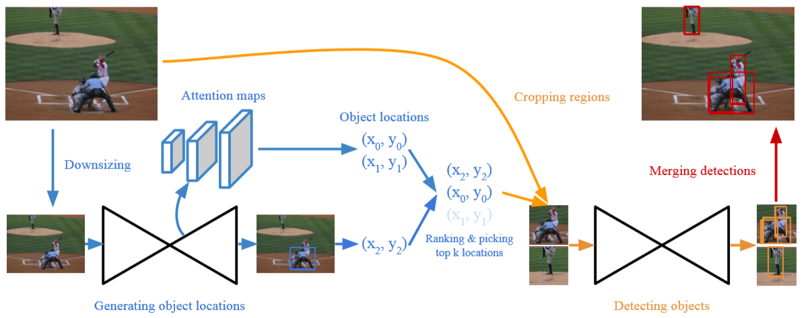

# Law, 2018, CornerNet

*CornerNet: Detecting Objects as Paired Keypoints*

## Forward

1. 预处理部分为一个nn.Conv2d(3, 128, 7, padding=3, stride=2)和一个Residual(128, 256, stride=2)残差块结构，上图中未画出；
2. Backbone选择了Hourglass Network，通过串联两个Hourglass模块组成；
3. 两个预测模块分别检测左上角和右下角，特征网络的输出经过Corner pooling后分别预测：
	a. Heatmaps：C×H×W，其中C表示目标类别(无背景类)，输出值为0~1，代表该点是角点的概率；
	b. Embeddings：1×H×W，代表该点可能属于的角点组别；
	c. Offsets：2×H×W，代表从Heatmaps映射回原图时的量化误差。

- Corner pooling：CornerNet的一个重要创新点。如上图所示，图像往往是不规则的，因此其角点通常和特征本身不相干。以TopLeft为例，为获取Anchor的左上角点，我们需要从下往上和从右往左看，这也就引入了Corner pooling的操作。特征提取网络的结果通过卷积(3×3→BN→ReLU)生成两张Feature map，各自通过Corner pooling后再对应相加输出。实际中Output还需要经过一个改进的Residual模块处理后再输出。

## Backward
损失函数：
1. Heatmaps：首先需要对数据进行处理，不仅仅是在Ground truth的角点位置标记为1，同时也根据高斯分布将其周围均做上标记，标记值为$$ \exp(-4.5(x^2+y^2)/R^2) $$，其中R表示标记范围，选用了R=3σ。Heatmap部分采用的损失函数见下，其中p表示预测值，y表示真实值，属于改良版的Focal Loss，参数α控制难易分类样本的权重，参数β则对负样本进行了衰减，因为距离Ground truth角点较近的点形成的预测框和Ground truth也有着较大的重叠面积;
$$
L_{det} = \frac{1}{N}\sum_{c=1}^{C}\sum_{i=1}^{H}\sum_{j=1}^{W}
\begin{cases}
(1-p_{cij})^\alpha(-\log(p_{cij})) & if\ y_{cij}==1\\
(1-y_{cij})^\beta(p_{cij})^\alpha(-\log(1-p_{cij})) & otherwise
\end{cases}
$$
2. Embeddings：每张图中可能出现多个图像，因此如何将角点两两分组就相当关键了。作者借鉴了人体姿态检测的Associative Embedding方法，使用ek表示第k个类别的平均距离，因此Lpull将使得相同类别靠近，而Lpush将使不同类别远离。文中修改了Lpush的结构如下，式中的Δ=1，这部分的损失值仅在真实的角点位置进行计算;
$$
L_{pull} = \frac{1}{N}\sum_{k=1}^{N}[(e_{tk}-e_k)^2+(e_{bk}-e_k)^2],
L_{push} = \frac{1}{N(N-1)}\sum_{k=1}^{N}\sum_{j=1,j\ne k}^{N}\max(0,\Delta-|e_k-e_j|)
$$
3. Offsets：生成的Heatmaps的空间分辨率小于原图像，当其被重新映射回原图时，将会丢失一些精度，因此需要通过Offset微调。这里使用了SmoothL1Loss求和计算，并且同样仅在真实的角点位置进行计算，从而将所需的偏移量学习出来，并在Heatmaps映射的过程中被添加到角点坐标上以提高精度。
$$
L_{off} = \frac{1}{N}\sum_{k=1}^{N}SmoothL1Loss(o_k,\hat o_k),
o_k = (\frac{x_k}{n}-[\frac{x_k}{n}],\frac{y_k}{n}-[\frac{y_k}{n}])
$$
训练细节：
1. 应用了Focal Loss中提到的偏置初始化(π=0.1→b=-2.19)；
2. 数据增强使用了随机水平翻转、随机缩放、随机裁剪、和随机颜色抖动(亮度、饱和度和对比度)，保持图像的原始分辨率，并在输进网络前用零填充并经过了PCA处理；
3. 使用Soft-NMS筛选出100个左上和100个右下角点并用offset校正，然后将不同类别或Embedding距离大于0.5的角点对排除。

## Lite
任何一个目标检测器的速度都可以从 2 个方向去改进：降低要处理像素的数量或者减少每个像素点上要处理的步骤，这分别引出了CornerNet-Lite中的Squeeze和Saccade。
融合两者特征的CornerNet-Saccade-Squeeze也在文中被提及，但是由于要使用Saccade机制，需要生成足够准确的Attention maps，但是CornerNet-Squeeze由于缩减了网络的像素数量，不具备进行Saccade的能力。

CornerNet-Saccade 使用缩小后的图片来生成Attention maps和粗略的边框，两者均能提供可能的物体划分Anchor。然后在高分辨率的原图上切割图像来精确预测目标的检测框和分类类别。网络可以通过调节每张图片上物体位置的最大个数来平衡精度和速度。

CornerNet-Squeeze 减少每个像素点上需要处理的步骤，以此来加速推理，其改进之处包括：
1. 将Residual block替换为 Fire module，并将第二层的3x3标准卷积替换为 3x3 深度可分离卷积；
2. 将网络预处理部分中的两次2倍下采样增加为3次2倍下采样(提速的关键点)；
3. 将Backbone中的Hourglass网络层数由5层降为4层；
4. 将预测模块中的3x3卷积替换为1x1 卷积；
5. 将最邻近插值上采样更换为4x4的反卷积/转置卷积。