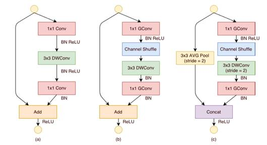
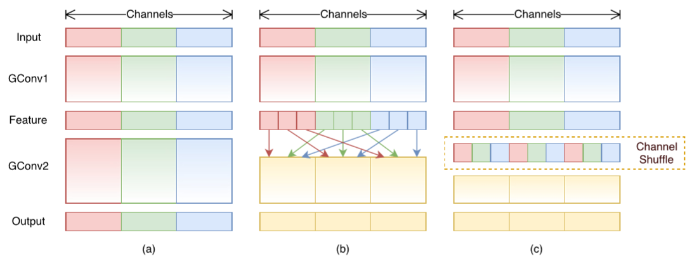
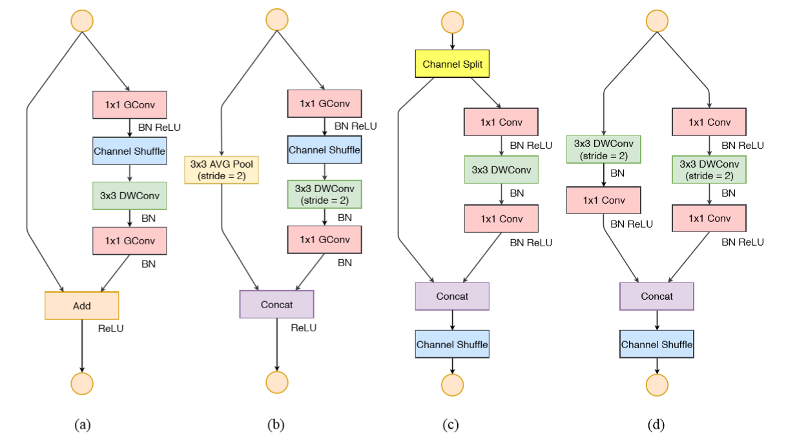

# ShuffleNets

## V1
*ShuffleNet:  An Extremely Efficient Convolutional Neural Network for Mobile Devices*

- 上图中的(a)是一个标准的Bottleneck单元，(b)则是将普通卷积替换为分组卷积并且添加了Shuffle操作的ShuffleNet模块，(c)将步长设为2，同时通过Concat一个平均池化层来弥补特征损失。

分组卷积(Group)可以理解为深度可分离卷积(Depthwise)的一个推广形式(实际上Group早在AlexNet时就已经出现)。图7中的(a)阐明了分局卷积的劣势在于输出的Feature map不能做到包含每一个输入的Feature map信息，(b)将分组卷积后的输出均分重排，使得输入输出通道完全相关，(c)给这个操作起了个名字叫Shuffle。
1. 使用Group Convolution代替Depthwise Convolution，后者实际上是前者的一个Group=1的特例;
2. 使用Shuffle操作代替Pointwise Convolution操作解决Feature Map的BUG，减少了大量1×1的卷积运算;
3. 引入了ResNet中的Residual block和Bottleneck概念，用瓶颈结构学习残差函数进一步优化模型大小和准确性。

## V2
*ShuffleNetV2: Practical Guidelines for Efficient CNN Architecture Design*

四个基础实验结论如下：
1. 拥有相同通道数的卷积层能得到最小的内存访问消耗时间(MAC)；
2. 过多的group convolution会增加MAC；
3. 网络分支将会降低并行度，因此在GPU这类设备上跑的时候速度慢；
4. 元素操作(指矩阵加)消耗的时间不可被忽略。

可以意识到ShuffleNetv1使用类似bottleneck的模块(结论1)和GConv(结论2)，MobileNetV2使用反转的bottleneck(结论1)并在更深的层上使用DWConv(结论4)，以及一些其他的网络高度分支化(结论3)，这些都将导致速度的降低。

基于上述实验结果，ShuffleNetV2被提出，它和ShuffleNetV1的模块区别见上图10。我们先对比图中的(a)和(c)：用Channel Split起到原先分组卷积的作用，并选择平分通道，对应上述结论1；将分组卷积换回了标准卷积，对应上述结论2；一侧通路上的数据未进行操作，对应上述结论3；用连接操作代替了元素和操作，对应上述结论4；将Channel Shuffle移至连接操作后，这是由于分组卷积已经换回标准卷积，没有Shuffle的必要，但连接后还是需要的。图中的(b)和(d)则是(a)和(c)增加步长后的变体。
作者在对比大量不同的网络性能时，发现Xception在检测上做的比分类要好，原因可能是它拥有较大的感受野。因此在每个模块的第一个Pointwise前面，作者都添加了一个3×3的DWConv，速度肯定会受到影响，但是准确性提升了不少。