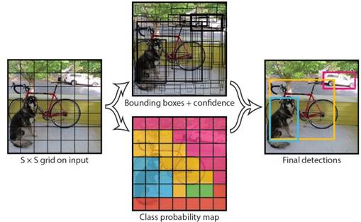
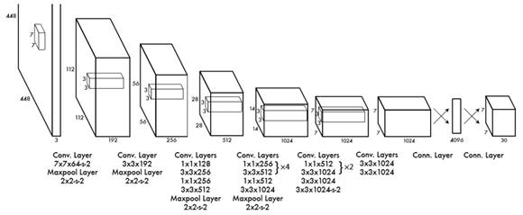
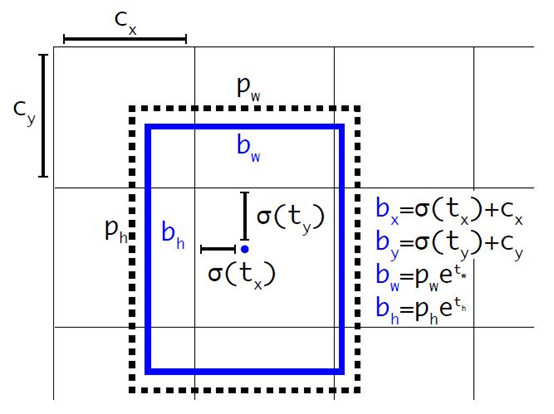
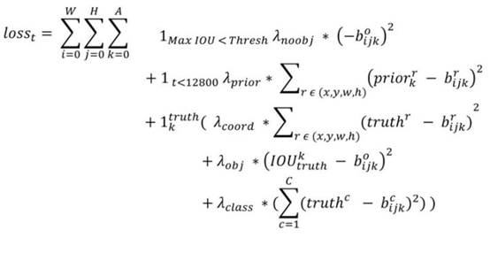
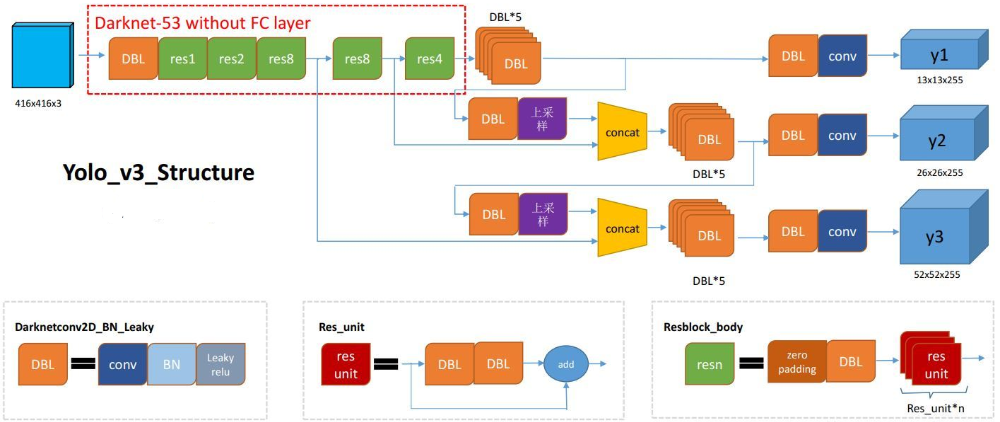
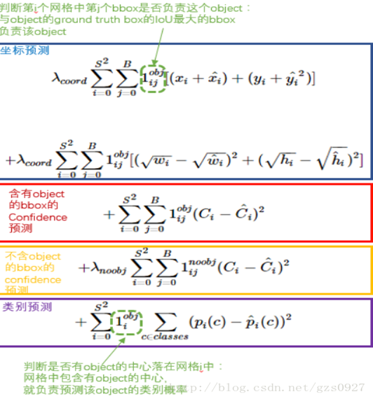

# YOLO
*(Not finished yet)*

## V1

YOLO(You Only Look Once) V1：将图像划分为S×S个网格，每个网格将会根据B个边界框进行预测，其输出值有x, y, w, h, c，分别表示边界框的位置、大小和置信度(是否包含目标和IOU的乘积)，且被图像大小归一化到[0, 1]。

作者在V1版本中选择检测20类物体，划分7×7个网格，根据2个边界框进行预测，因此网络的输出值为：7×7×30(20类物体概率+两个框的置信度 +两个框的位置和大小)。简而言之，YOLO暴力地将分类与回归统一作为回归问题进行操作，将物体的分类概率和大小位置信息在同一个网络中加以学习。其优点在于网络简单易于理解、检测速度快且通用性强。其缺点在于位置精度低、每个网格单元的感受野有限且无法检测类似鸟群的小而密集的物体。

## V2

YOLO V2是V1版本的改进，其原则为保持检测速度的同时压榨模型的定位准确度和召回率，文中采用的手段有：
1. Batch Normalization：提升收敛速度、降低过拟合程度。YOLO V2在每个卷积层后面都添加了BN层并且不再使用Dropout随即丢弃数据;
2. High Resolution Classifier：YOLO V2采用了448×448的图像分辨率;
3. Convolutional With Anchor Boxes：YOLO V1中物体检测框的大小是通过网络学习的，而训练中适应不同物体是困难的，作者在V2中则选用预先设定的不同尺度和比例的Boxes进行预测。同时在V1中，两个边界框共享同一组分类概率，在V2中则是每个位置的每个分类框均单独预测一套分类概率值。网络用卷积替代了最后的全连接层并取消了一个池化层已获得更好的性能。同时将分辨率改为416×416以使得特征图尺寸为奇数;
4. Dimension Clusters：考虑到手动设置的分类框可能与数据不尽相符，YOLO V2使用K-Means聚类算法预先学习了分类框的尺寸，其距离值定义为d(box, centroid) = 1-IOU(box, centroid)，且预设种子点的数量K=5;

5. Direct location prediction：作者发现在使用固定大小的分类框时，对其位置的学习不太稳定，因为可能该点的分类框框进了邻域内的物体，导致分类框的偏移量x，y需要过长的时间进行学习。由示意图可知分类框的相对坐标x, y是直接学出来的，但在之前的基础上通过通过sigmoid限制了它将不会偏移网格点过远。而分类框的尺寸则是在先前的基础上逐步调整得到。注意在自调整的分类框取代了上述的分类框预先聚类;
6. Fine-Grained Features：使用13×13的特征图对大物体检测来说已经足够了，但为了提高小物体的检测精度，YOLO V2提出了Passthrough Layer，它将以2×2的池化抽取先前层的特征并concatenate在一起;
7. Multi-Scale Training：YOLO V2使用相同图片的不同分辨率进行训练，从而获得了对不同尺寸的良好适应性;
8. DarkNet-19：YOLO V2使用带有Batch Normalization的DarkNet作为训练网络;

9. 优化的Loss: 对于训练图片中的ground truth，若其中心点落在某个cell内，那么该cell内的5个先验框中与ground truth的IOU最大的边界框预测它，而剩余的4个边界框不与该ground truth匹配。YOLOv2同样需要假定每个cell至多含有一个ground truth，而在实际上基本不会出现多于1个的情况。与ground truth匹配的先验框计算坐标误差、置信度误差（此时target为1）以及分类误差，而其它的边界框只计算置信度误差（此时target为0）。

## V3
YOLO V3在V1V2的基础上做了进一步的改进，它保留的主要特点包括：
1. 划分网格进行检测，一个Loss训练全部内容，端到端的模式；
2. Batch Normalization + Leaky ReLU；
3. 允许多尺度训练以在速度和准确性之间加以平衡。

- DBL：DarkNet Conv+BN+LeakyReLU，YOLO V3的基本组件。
- Res unit：残差块结构。
- Res n：表示这个res模块中有几层Bottleneck。

1. YOLO V3通过卷积步长替代了V2中的池化层，同时使用了残差块结构以训练更深的网络DarkNet-53；
2. Predictions Across Scales：V3中借鉴了FPN的思想，采用多尺度来对不同size的目标进行检测，越精细的网格划分就可以检测出越精细的物体，也就是上图中的y1, y2和y3。每种网格划分同时预测三个分类框，每个分类框有5个参数和80个分类概率，因此输出深度为3\*(5+80)=255。而YOLO V3并没有像SSD那样从中间层直接输出Feature Map，而是将中间层输出和后一层输出的上采样concat后作为预测使用的Feature Map；
3. Bounding Box Prediction：在V2的基础上将K聚类的种子值设为9，并且在COCO上进行了回归。这次V3没有像V2那样直接抛弃训出来的最佳分类框大小，而是每一轮都对9个分类框进行逻辑回归。同时根据分类框的大小划分到上图中的y1, y2和y3，最终根据得分最高的分类框输出预测的详细信息。

## V4