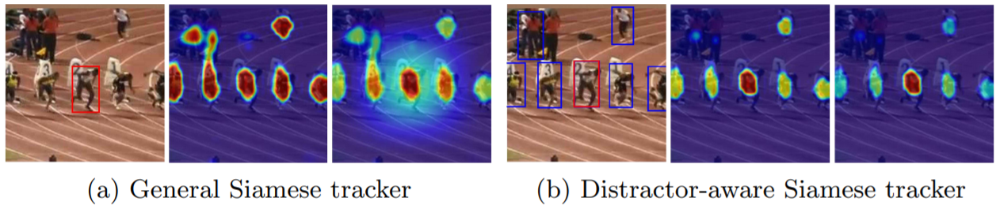
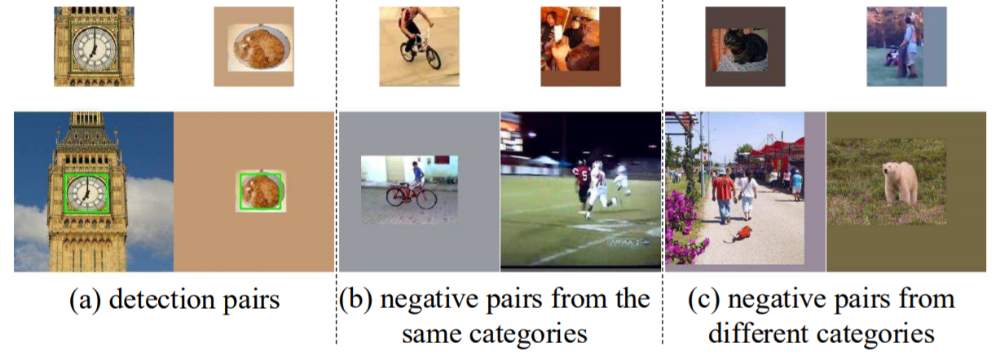
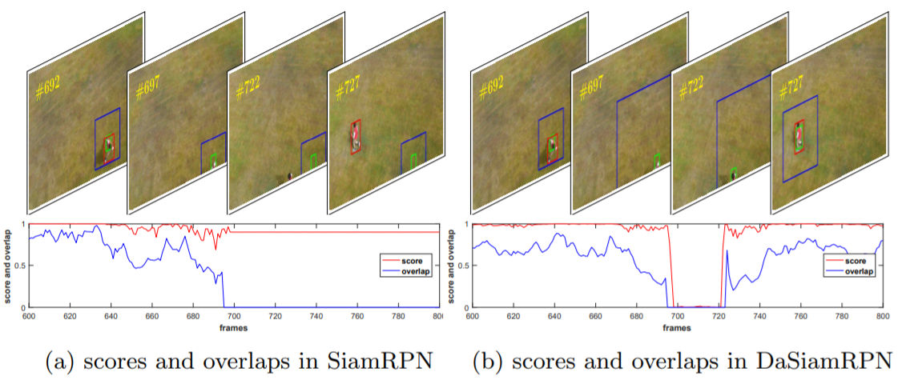

# Zhu, 2018, DASiamRPN

*Distractor-aware Siamese Networks for Visual Object Tracking*

## Forward


1. 新的干扰器抑制策略
   - 传统Siamese类采用的是在Heatmap上加高斯窗进行抑制；
   - DASiamRPN将上一帧中的强干扰器(NMS)在本帧中直接减去，从而实现更精准的抑制；
   - 输出响应$$ q = argmax(\varphi(z)\star\varphi(x) - \hat\alpha\dfrac{\sum\alpha_i\varphi(d_i)\star\varphi(x)}{\sum\alpha_i}) $$
   - 考虑到互相关运算是线性操作，上述公式可变型为：$$ q = argmax((\varphi(z) - \hat\alpha\dfrac{\sum\alpha_i\varphi(d_i)}{\sum\alpha_i})\star\varphi(x)) $$
   - 式中超参数$\hat\alpha=0.5$，$\alpha_i$指强干扰器的得分，$d_i$指第$i$个强干扰器所在的区域。
2. 增量学习逻辑
   - 引入增量学习：$$ q = argmax((\dfrac{\sum_{t=1}^T\beta_t\varphi(z_t)}{\sum_{t=1}^T\beta_t}- \hat\alpha\dfrac{\sum_{t=1}^T\beta_t\sum_{i=1}^N\alpha_i\varphi(d_i)}{\sum_{t=1}^T\beta_t\sum_{i=1}^N\alpha_i})\star\varphi(x)) $$
   - 式中超参数$\beta_t$指学习率，通过这种方式逐帧累加目标模板和干扰模板。
3. SiamRPNBIG
   - Backbone
       - 在SiamRPN的基础上扩大了搜索区域(255→271)和各层通道数(256→512)
       - 特征提取：self.featureExtract 
       - 模板分支：self.conv_r1 坐标回归，self.conv_cls1 分类
       - 检测分支：self.conv_r2 坐标回归，self.conv_cls2 分类
       - self.regress_adjust 文中没细说 看名字是reg的微调 1x1卷积
   - Template
       ```Python
		def temple(self, z):
			z_f = self.featureExtract(z)
			r1_kernel_raw = self.conv_r1(z_f)
			cls1_kernel_raw = self.conv_cls1(z_f)
			kernel_size = r1_kernel_raw.data.size()[-1]
			self.r1_kernel = r1_kernel_raw.view(
		        self.anchor*4, self.feature_out, kernel_size, kernel_size)
       	self.cls1_kernel = cls1_kernel_raw.view(
               self.anchor*2, self.feature_out, kernel_size, kernel_size)
       ```
   - Forward
       ```Python
		def forward(self, x):
           x_f = self.featureExtract(x)
           return self.regress_adjust(
        		F.conv2d(self.conv_r2(x_f), self.r1_kernel)), 
       		F.conv2d(self.conv_cls2(x_f), self.cls1_kernel)
       ```
       
## Backward
1. 新的训练数据
   
   - 作者单纯从跟踪数据集上训练的模型，喂的参数量还是不够，因此将ImageNet和COCO数据集引入；
   - 通过诸如平移缩放灰度变化高斯模糊等数据增强方法模拟跟踪问题中的正样本对；
   - 采样同类但不同物体作为困难负样本，不同类物体作为简易负样本。

## Others
1. Long-tern策略
   
   - 上图中红色框为真值，绿色框为跟踪结果，蓝色框为搜索区域；
   - 搜索区域不再恒定，而是根据上一帧的跟踪置信度进行调整，以便在丢失物体后重新进行检测和跟踪。
