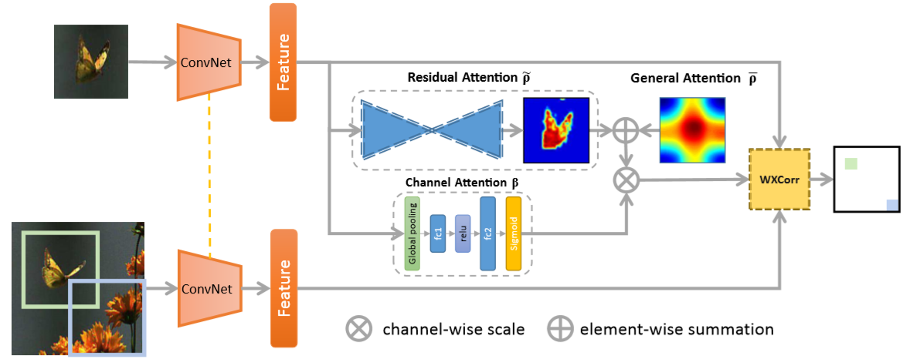
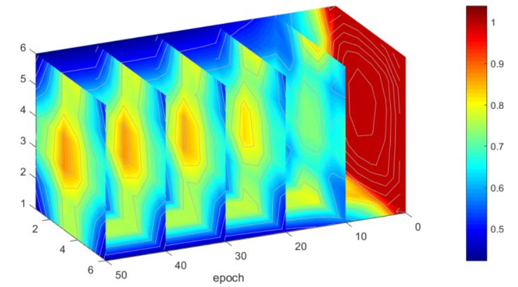
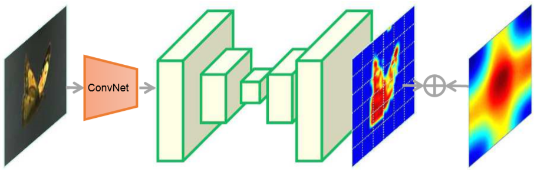
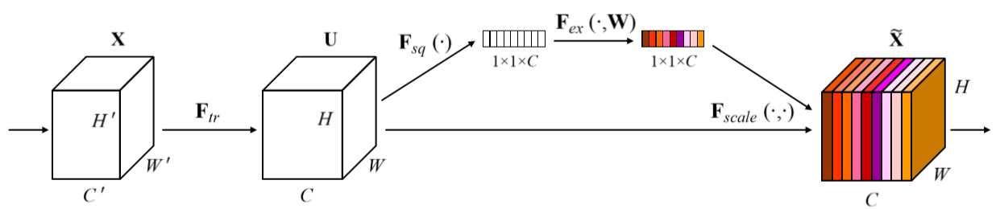
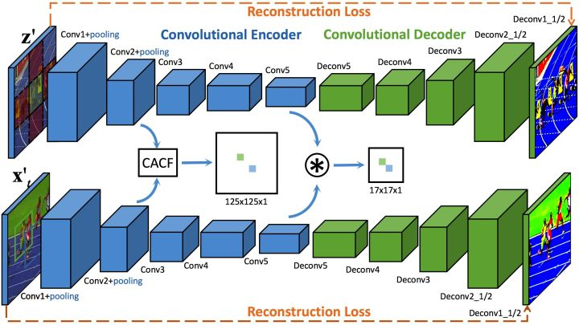

# Wang, 2018, RASNet

*Learning Attentions: Residual Attentional Siamese Network for High Performance Online Visual Tracking*

## Forward


1. SiamFC的基础结构中，模板中必然存在不属于前景的信息，然而在做互相关计算时提供了相同的权重，而采用高斯框对周围进行抑制的方案又人为添加了错误的先验(物体在正中间)。RASNet添加了三个attention机制意图更好地区分模板中的前景和背景，对模板的总权重因子$$  \gamma = (\bar\rho + \widetilde\rho)\times\beta. $$
   
```Python
class RASNet(nn.Module):
    def __init__(self):
        nn.Module.__init__(self)
        self.feature_extraction = AlexNetLike()
        self.general_att = torch.ones([1, 1, 6, 6], requires_grad=True)
        self.residual_att = ResidualAttentionNet()
        self.channel_att = ChannelAttentionNet()
        self.adjust = nn.Conv2d(1, 1, 1, 1)

    def forward(self, z, x):
        # get features
        x_feature = self.feature_extraction(x)
        z_feature = self.feature_extraction(z)
        # spatial & channel attention
        spatial_attention = self.general_att + self.residual_att(z_feature)
        channel_attention = self.channel_att(z_feature)
        z_feature = spatial_attention * channel_attention * z_feature
        return self.adjust(xcorr(z_feature, x_feature))
```

   - General Attention
     
     使用一个全1的矩阵进行初始化，考虑到跟踪问题的特点，最终学到的分布$$\bar\rho$$也确实类似高斯框。

	- Residual Attention
	  
	  用一个Hourglass结构学习模板的特征, 同样作为空间上的权重。**预测变换参数要比直接预测输出更容易, 并且希望残差学习的部分的均值近似为0, **也就是说在SiamFC直接使用cos窗/高斯框加权的基础上通过特征图去学一个空间抑制的变化方向$$\widetilde\rho$$。

```Python
class ResidualAttentionNet(nn.Module):
    def __init__(self):
        nn.Module.__init__(self)
        self.residual_attention = nn.Sequential(
        nn.Conv2d(256, 256, 3), nn.ReLU(inplace=True),
        nn.Conv2d(256, 256, 3), nn.ReLU(inplace=True),
        nn.Conv2d(256, 256, 2), nn.ReLU(inplace=True),
        nn.ConvTranspose2d(256, 256, 2), nn.ReLU(inplace=True),
        nn.ConvTranspose2d(256, 256, 3), nn.ReLU(inplace=True),
        nn.ConvTranspose2d(256, 1, 3), )

    def forward(self, x):
        return self.residual_attention(x)
```

   - Channel Attention
	  
      作者直接用一个SE模块得到各通道的attention值$$\beta$$，通过网络根据Loss去学习特征权重，使得有效的通道权重大，无效或效果小的通道权重小的方式训练模型达到更好的结果，从而实现通道自适应调整。跟踪大多只在网络的最后一层使用SENet模块，可以把每一个通道理解为一个独立的分类器/跟踪器，**SENet实际上是通过分析特征后(global pooling+fc)对这些分类器进行加权。**

```Python
class ChannelAttentionNet(nn.Module):
    def __init__(self, channel=256, reduction=16):
        nn.Module.__init__(self)
        self.avg_pool = nn.AdaptiveAvgPool2d(1)
        self.fc = nn.Sequential(
        nn.Linear(channel, channel // reduction), nn.ReLU(inplace=True),
        nn.Linear(channel // reduction, channel), nn.Sigmoid(), )

    def forward(self, x):
        b, c, _, _ = x.size()
        y = self.avg_pool(x).view(b, c)
        y = self.fc(y).view(b, c, 1, 1)
        return y.expand_as(x)
```

## Backward
1. 为了防止过拟合，训练过程中相距越远的帧所提供的loss值应该越低，因此给损失函数添加了一个权重$$ \Omega(i,j) = exp(-\dfrac{|i-j|}{\sigma}) $$；

## Others
1. SiamFC的高层特征只抽取了语义表述，却丢失了细节的表述，很容易漂移到表观差异巨大但属性类似的distractor。一方面是网络深了之后自然而然的带来的细节的丢失，另一方面训练的过程中只考虑了判别学习，细节信息本身是否保留就没有保障了。为了诱导网络更好的进行学习，作者在EDCF中考虑Encoder-Decoder结构来强迫网络记忆细节信息，同时利用中间监督来优化学习过程。

图中CACF指在目标周围采集困难负样本训练，使得仅目标有高响应而其周围的图像响应接近零。但其实让网络即对各种光照旋转等各种变化长时间鲁棒，又对不同目标产生较大差异，这个目标本身是有点矛盾的。