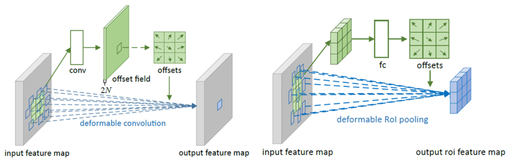

# Yu, 2020, SiamAttn

*Deformable Siamese Attention Networks for Visual Object Tracking*

## Forward
1. 总体结构
   
   - 利用DSA Module对backbone的特征进行融合；
   - SiamRPN++结构输出Cls和Reg的特征；
   - Depthwise的互相关计算并送入Region Refinement Module获取mask和bbox。
2. DSA(deformable Siamese attention) Module
   
   - Self-Attention：对空间位置，由于感受野的限制只能从局部patch中获取信息，无法得到全局上下文信息；对不同通道，每一个通道都表示特定种类别的特征，平等对待所有通道并不是一个好的选择；
       - Matrix Operation：
         1. 用$1\times1$卷积获取query feature Q和key feature K并reshape到$C\times N,N=W\times H$；
         2. 计算Attention矩阵$$ A =softmax_{col}(Q^TK)\in\mathbb{R}^{N\times N} $$;
         3. 计算Attention结果$$ X_s^s=X+\alpha AX $$并reshape回$C\times W\times H$。
      - Spatial ：特征和QK的通道数均被压缩到C/8以减少计算量；
      - Channel ：特征处理为$C\times C$后做矩阵乘法。
   - Cross-Attention：Siamese结构的跟踪框架往往Z和X是独立的，但显然在跟踪过程中更新目标特征是非常有意义的。譬如UpdateNet给出了一个模板更新的方案，SiamAttn则更为彻底，直接让Z和X互相加Channel Attention以生成更有判别性的特征表达，可以视为一中模板更新策略；
3. Region Proposal Network
   - 相当于把SiamRPN++用来跑RPN的feature通过DSA Module处理后操作；
   - 输入的三组feature还会额外跑一个深度互相关计算用于refinement。
4. Region Refinement Module
   - Fusion Block：通过上采样和1x1卷积将三组特征对齐后相加；
   - RoI Pooling：把RPN和Fusion的结果通过Deformable pooling到所需的大小后相加；
   - BBox为25x25，Mask为64x64，不需要Classification Head。
5. Deformable
   
   - Convolution
      - 输入feature通过卷积计算对应点的offset，然后根据offset找到对应位置的值累加输出；
      - v1相当于一个可学习的采样模块，v2添加了可学习的amplitude更convolutional。
   - RoI Pooling
      - 先pooling，再通过全连接计算offset，最后根据offset采样求均值。

## Backward

1. Backbone：ImageNet上预训练的ResNet-50；
2. 损失函数：
   - RPN-cls：lambda=1，负对数似然；
   - RPN-reg：lambda=0.2，Smooth L1；
   - Refine-box：lambda=0.2，Smooth L1；
   - Refine-mask：lambda=0.1，二值交叉熵。