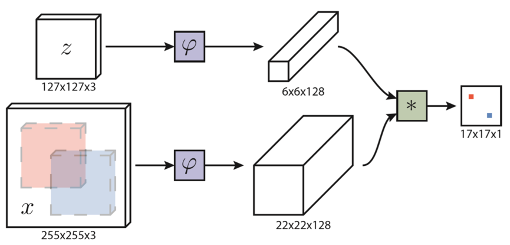

# Bertinetto, 2016, SiameseFC
*Fully-Convolutional Siamese Networks for Object Tracking*

## Pre-processing
1.  Template z: 127×127×3, Image x: 255×255×3;
2.  对任意w×h图像和标签均有A=s(w+p)×s(h+p), 其中s为缩放因子, p=(w+h)/2;
3.  以上一帧检测结果为中心，切割模板四倍大小的区域作为当前帧的检测区域.

## Forward


1. Backbone φ → φ(z): 6×6×128, φ(x): 22×22×128

2. 互相关计算: φ(z)×φ(x)+b = f(z,x): 17×17×1
   
    ```Python
    def xcorr(feature, kernel):
        return f.conv2d(feature, kernel)

    def xcorr_expand(feature, kernel):
        kernel_b, _, kernel_w, kernel_h = kernel.size()
        _, feature_c, feature_w, feature_h = feature.size()

        kernel = kernel.view(-1, feature_c, kernel_w, kernel_h)
        feature = feature.view(1, -1, feature_w, feature_h)
        out = f.conv2d(feature, kernel, groups=kernel_b)
        return out.view(kernel_b, -1, out.size(2), out.size(3))
    ```

3. 双三次插值上采样: 272×272×1
   
   > We found that upsampling the score map using bicubic interpolation, from 17×17 to 272×272, results in more accurate localization since the original map is relatively coarse. 

    ```Python
    class SiameseFC(nn.Module):
        def __init__(self):
            nn.Module.__init__(self)
            self.backbone = AlexNet()
            self.adjust_conv = nn.Conv2d(1, 1, 1)
            self.upsample = nn.Upsample(size=(272, 272), mode='bicubic')

        def forward(self, z, x):
            kernel = self.backbone(z)
            feature = self.backbone(x)
            score_map = self.adjust_conv(xcorr(feature, kernel))
            return self.upsample(score_map)
    ```

## Backward
1.	$$ Loss =\frac{1}{|D|} \sum_{D}log(1+exp(-yv)) $$
2.	正负样本真值y: 根据该点到目标中心的实际距离标为±1{也许可以转为高斯};
3.	原文未提及预测值v的激活函数，猜测为tanh.
    ```Python
    def forward(self, score_map, gt_label):
        loss_map = -nn.Tanh()(score_map) * gt_label
        return torch.mean(torch.log(1 + torch.exp(loss_map)))
    ```

## Post-processing
1.  无光流,颜色直方图等特征, 无边界框回归等算法, 也不进行网络参数更新;
2.  在score_map上通过余弦窗惩罚位移;
3.  搜索多个比例尺以更新检测框大小, 同时惯性更新大小(0.35);
    ```Python
    def update_bbox_size(self, template, image, center)
        template_fea = self.backbone(template)
        max_score = 0
        best_size = self.bbox_size
        for pow_index in range(-2,3):
        temp_size = self.bbox_size * 1.025**pow_index
        crop_image = crop(image, center, temp_size)
        crop_score = xcorr(crop_image,template_fea).squeeze_()
        if crop_score.item() > max_score:
        best_size = temp_size
        self.bbox_size = 0.65 * best_size + 0.35 * self.bbox_size
    ```

4.  SiameseFC: 1.025^{-2,-1,0,1,2}, SiameseFC-3s: 1.025^{-1,0,1}.