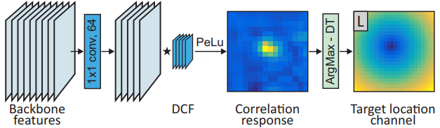
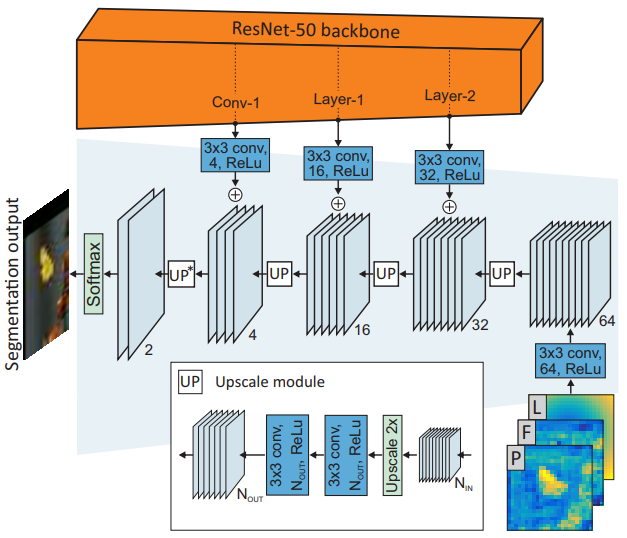

# Lukezic, 2019, D3S

*A Discriminative Single Shot Segmentation Tracker*

## Forward

训练过程：
1. 第一帧送入Backbone提取特征，通过不同分支获得定位(L, GEM)和前景F、背景B、Posterior(GIM);
2. LFP三个特征cat后送入Refinement，和Backbone的特征混合学习第一帧的Mask(Pos/Neg)。

推理过程：
1. 搜索区域送入Backbone提取特征，通过GIM获取前景F、背景B和Posterior；
2. 遍历模板和搜索，取相似度最高的K个像素求当前帧相似度的均值；
3. 同样cat送入Refinement获取当前帧的Mask和跟踪结果。

GIM(geometrically invariant model, 几何不变) 计算一个粗略的分割结果
1. 共享参数计算Features(3x3卷积无激活函数)并做L2标准化，模板的Mask插值到当前帧的搜索空间大小；
2. 对模板和搜索作`einsum('ijkl,ijmn->iklmn')`，在通道维度相乘计算相似度，并将mn(搜索区域维度)变形为向量；
3. 找到mn向量上的topK特征图(Bkl)，求平均即可得到搜索帧上的前景和背景特征，前景F和背景B在cat后做Softmax，获得当前帧的Posterior。

GEM(geometrically constrained Euclidean model, 几何约束) 解决强干扰项的问题
1. 当前帧特征经过降维后和模板特征执行DCF以获得互相关响应；
2. 找到响应图上的argmax，按照欧氏距离生成定位L(Distance transform)。

Refinement Module
1. Posterior，前景F和定位L一起cat后送入Refinement，通过Upsample和Backbone特征混合；
2. 最终得到两通道特征图，Softmax后即为当前帧的跟踪结果(Mask)。

## Others
1. Bounding box fitting module: Mask的阈值为0.5且只保留最大联通区域，通过椭圆去拟合外轮廓从而获得最终定位的中心和大小；
2. Mask初始化：如果只有边界框则需要用GIM模块进行多次迭代(类似GrabCut[?])；
3. 新的帧裁剪四倍大小区域送入模型，GIM的Mask不会改变，但GEM的DCF模块会得到更新。
