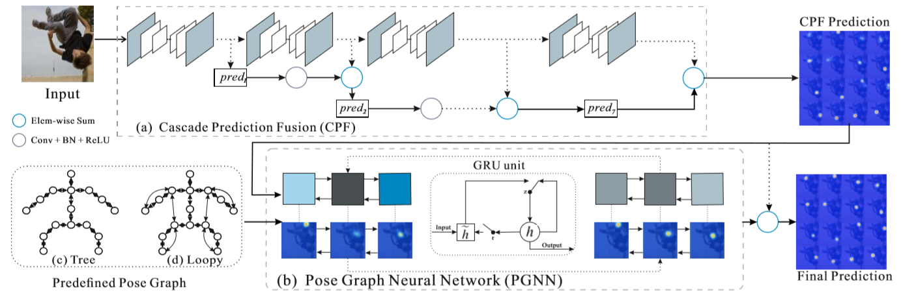

# Zhang, 2019, Cascade Prediction Fusion
*Not finished yet*
*Human Pose Estimation with Spatial Contextual Information*

## Forward

1. 级联预测融合(Cascade Prediction Fusion, CPF)：预测关键点，基础模块仍选用了经典的Hourglass，直观上看，来自较低层的预测具有更准确的定位信号，而较高层的预测具有较强的语义信息以区分相似的关键点，网络通过CPF创建的较短路径有效地融合来自不同阶段的信息；
2. 姿态图神经网络(Pose Graph Neural Network, PGNN)：采用图网络对输出的角点坐标进行校正，考虑到每个节点与相连部位的关联，估算位置和空间结构。

## PGNN图结构