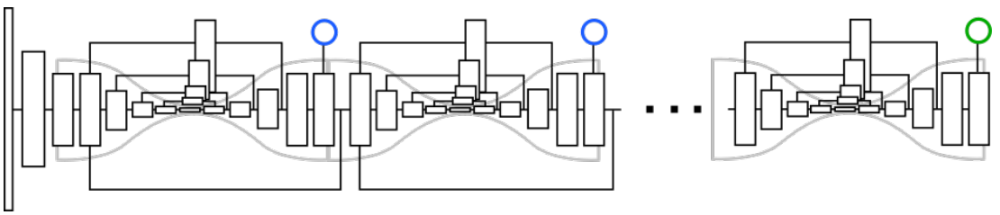

# Newell, 2017, Associative Embedding
*(Not finished yet)*
*Associative Embedding: End-to-End Learning for Joint Detection and Grouping*

## Forward

计算机视觉中检测和分组通常紧密耦合：检测较小的视觉单元并将它们分组为更大的结构。例如，多人姿势估计可以被视为检测身体关节并将其分组为不同的个体；实例分割可以被视为检测相关像素集合并将它们分组到不同的对象实例中；多对象跟踪可以被视为检测对象实例并将它们分组到各自的轨迹中。在类似上述情况的中，均可认为输出是可变数量的单元，并将它们分配到可变数量的组别中。

论文提出了关联嵌入(Associative Embedding)来进行联合检测和分组输出，网络将会输出每个像素检测分数的HeatMap和身份标签的Tag。
Heatmap：通过2D高斯打标签，采用和Stacked Hourglass 网络相同的MSELoss。
Tag：对于包含k个元素的任意组别n，网络将会计算其均值hn，并通过两部分的Loss将同一个组别内的Tag值拉近，将不同组别间的Tag值推远。

## Backward

作者在文中写道：“It is important to note that the absolute values of the tags do not matter, only the distances between tags. That is, a network is free to assign arbitrary values to the tags as long as the values are the same for detections belonging to the same group.“也就是说，标签的值具体是多少无关紧要，只有不同标签之间的差异被重视，网络可以自由地为标签分配任意值，只要保证属于同一组的标签值尽可能相同。
