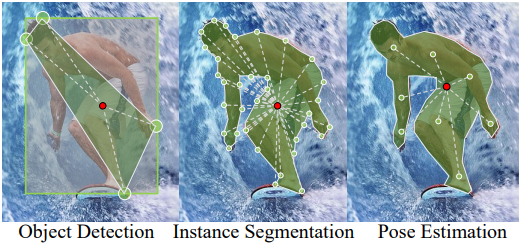
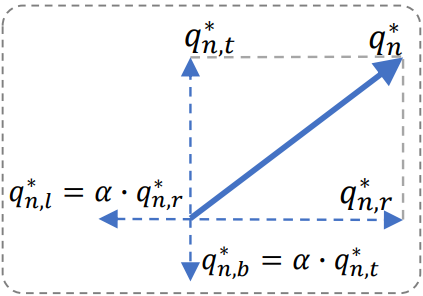

# Duan, 2021, Cross IOU

*Location-Sensitive Visual Recognition with Cross-IOU Loss*

URL: 

## TL;DR

1. 目标检测(bbox) 实例分割(mask) 姿态估计(key point) 统一成vector

## Cross-IOU Loss

1. 模长：通过类似IOU的方式监督和真值的比例
2. 相角：将向量拆到四个方向监督而非单一方向