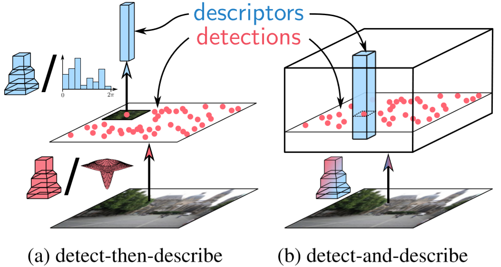
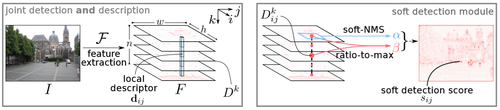

# Dusmanu, 2019, D2-Net
*D2-Net: A Trainable CNN for Joint Detection and Description of Local Features*

## Forward

检测-描述方法，通过先搜索关键点，然后根据关键点附近的像素区域进行描述。然而面对环境条件变化，其表现不是很好，研究认为其原因在于关键点检测器的可重复性不佳。较低层级的变化例如光照的强度往往可以影响检测器。
稀疏本地特征(Sparse local features)：推迟检测阶段，首先通过CNN计算一组特征图，然后使用特征图来计算描述符，并检测关键点，从而尝试平衡Local和Non Local。方法的缺点在于由于计算了更密集的描述符，因此效率较低。基于更高层级的检测可以获取更健壮但是不太准确的关键点。本文建议使用密集的特征提取以同时获得检测器(Detector)和描述符(Descriptor)，因此网络起名为D2-Net。

特征检测：
1. 局部响应得分 $$ \alpha_{ij}^k = Softmax(D_{ij}^t) $$, 通道选择得分$$ \beta_{ij}^k = \frac{D_{ij}^k}{\max D_{ij}^t} $$, 关键点得分 $$ \gamma_{ij} = \max(\alpha_{ij}^k\times\beta_{ij}^k) $$;
2. 作者使用图像金字塔(image pyramid)提高网络对于输入尺度的不变性，对于给定输入，创建其不同分辨率的数据，各自计算网络输出，然后计算等效的输出，也即将生成的低分辨率的图像融进高分辨率图像中进行训练，从而增强网络的鲁棒性;
