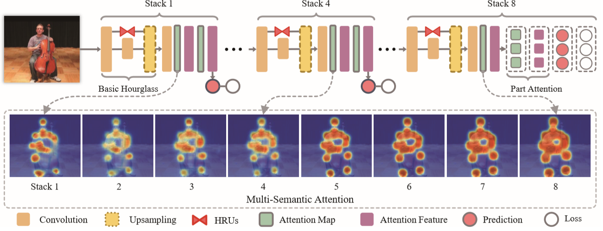
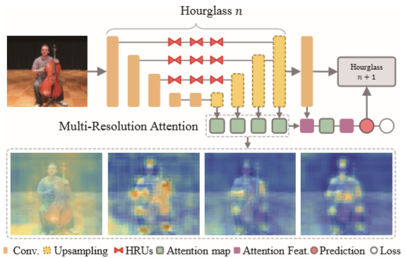

# Chu, 2017, Multi-Context Attention
*Not finished yet*
*Multi-Context Attention for Human Pose Estimation*

## Forward

1. 使用多层注意力机制促使模型关注感兴趣的区域，使用CRF代替Softmax模拟相邻关节；
2. 提出了一个残差沙漏单元(Hourglass Residual Unit, HRU)，提供不同感受野，同时使得网络在较早的层就能看大较大的区域。

1. 使用8堆叠的沙漏网络作为Baseline，应用中间监督，并使用HRU单元代替了原网络中的残差块结构从而提示网络对不同尺度的鲁棒性；
2. 在每个沙漏网络中，根据尺度生成了多分辨率的注意力图，这些特征被融合以进一步生成下一阶段的注意力图，较低的尺度更关注于Local的特征，而较高的层级可以体现出全图的特征，譬如图1中的左膝，在较低的图中被遮盖，但在更高的图中被恢复;
3. 考虑到语义不同，在较前的1~4层中，对注意力图做融合后的整体处理，但在最后的5~8层中，将不同分别率的注意力图分别进行Loss计算和反向传播;
4. 由不同分辨率提取出来并上采样到统一大小的多重注意力，显然越低的层级越聚焦于局部的特征。

## 基于CRF的Attention机制