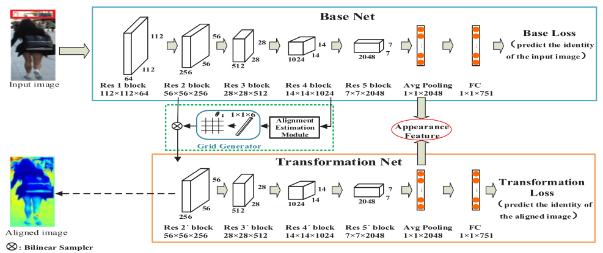

# Deep Alignment Network Based Multi-Person Tracking With Occlusion and Motion Reasoning

**Paper Reading Note**

URL: [https://ieeexplore.ieee.org/document/8488599/](https://ieeexplore.ieee.org/document/8488599/)

## TL;DR

提出一个deep alignment network用于校正检测器输出的bbox和特征对齐，并将其用于ReID和匈牙利匹配cost矩阵的外貌相似度计算。

## Deep Alignment Network Based Appearance Model

1. 利用高层特征预测一个仿射变换的6个参数(STN模型) 从而获得低层特征的alignment
2. 原图和affine后的特征向量concat成4096维的appearance特征用于后续匹配和重识别
3. 使用交叉熵损失预测物体的identity[?]

## Construct the Association Cost Matrices

1. $cost = \alpha IOU+(1-\alpha)cosine(appearance)$ ,根据IOU的大小给了不同的权重 $ \alpha$
2. IOU超过阈值时，为了在密集场景下获得更好的匹配，给外观分配更大的权重
3. IOU低于阈值时，正常工作大致平均地分配权重

## Occlusion Handling With Motion Reasoning and Re-Identfication

1. 首先使用EKF在物体被遮挡时预测其位置 然后在再次出现时用外观特征做ReID
2. $cost= \alpha IOU+(1-\alpha)cosine(appearance), \alpha=0\ if\ occlusion$
