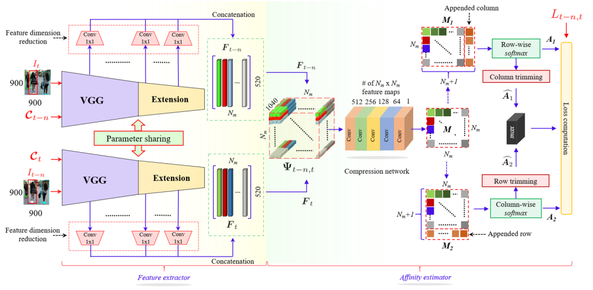

## **Deep affinity network for multiple object tracking**

**Paper Reading Note**

URL: [https://arxiv.org/abs/1810.11780](https://arxiv.org/abs/1810.11780)

## TL;DR

将表观特征和数据关联算法结合形成端到端的联合框架。

## Feature extractor & Affinity estimator

1. 从VGG+后续压缩层中根据经验选择9层，采样对应bbox中心位置的特征，concat成520维的向量
2. 假定有N个对象则就有 $ N\times 520$ 的特征图(不够的补零) $\rightarrow$ 变形成 $520\times N\times N$ 的特征张量
3. 把两个特征张量concat在一起并降维到 $1\times N\times N$ ，从而得到相关性矩阵M
4. 针对进出图像的情况对相关性矩阵加一行/列(超参 $\gamma$ )并作对应的softmax操作
5. 对亲和度矩阵M添加IOU mask后用匈牙利算法进行匹配以更新跟踪traj

## Network loss

1.  $L_1,L_2,L_3$ 分别指去掉行、去掉列和去掉行和列的二值关联矩阵
2. 前后匹配loss： $Loss_{1,2} = \frac{\sum L_{1,2}*(-\log A_{1,2})}{\sum L_{1,2}}$ ,让前后帧的对象互相匹配
3. 前后一致loss： $Loss=|| \hat A_1-\hat A_2||_1$ ,修剪掉进出图像的情况(单纯两者之间的关系)
4. 非最大关联抑制： $Loss= \frac{\sum L_3*(-\log\max( \hat A_1,\hat A_2))}{\sum L_3}$ ,把错误的大关联抑制掉

## Thoughts
1. Query本身 $Q\times BatchSize\times Channel$ 的大小也许可以直接用这个方案来进行匹配以代替IOU Matching，但这里也加了IOU mask以增强匹配效果，如何把mot进一步端到端还有待考虑。