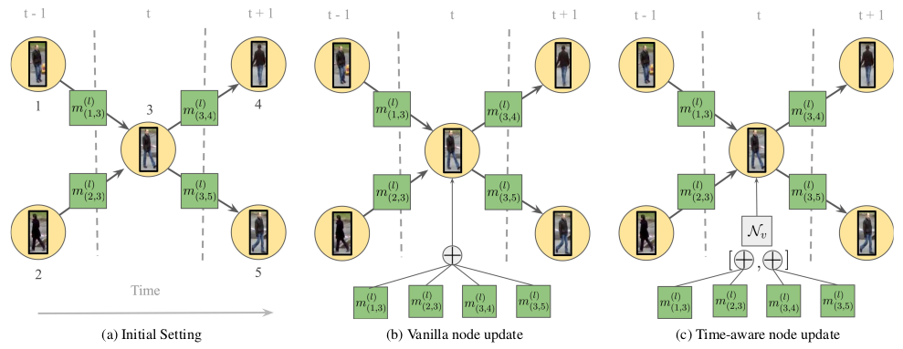

# Learning a Neural Solver for Multiple Object Tracking

**Paper Reading Note**

URL: [https://arxiv.org/abs/1912.07515](https://arxiv.org/abs/1912.07515)

## TL;DR

给所有的detection一个结点，计算他们边的cost，执行一个最大流算法以获得匹配 $\rightarrow$ 提出MPN直接预测边是否连接。

## Feature encoding
1. Appearance embedding：用ResNet50在bbox上提取作为结点的初始化；
2. Geometry embedding：边的初始化是三个部分concat在一起 $(\frac{x_j-x_i}{h_i+h_j},\frac{y_j-y_i}{w_i+w_j}, \log\frac{h_i}{h_j},\log\frac{w_i}{w_j}),(t_j-t_i),||N_v^{enc}(a_j)-N_v^{enc}(a_i)||_2$ ；

## Message Passing Networks
1. $(v\rightarrow e)\ h_{i,j}^{l}=N_e([h_{i}^{l-1},h_{j}^{l-1},h_{i,j}^{l-1}])$ 
2. $(e\rightarrow v)\ h_{i}^{l}=\Phi({N_v([h_{i}^{l-1},h_{i,j}^{l}])}_{j\in N_i})$ 

## Time-Aware Message Passing

1. $ m_{i,j}^{l} = N_v^{past|fut}([h_{i}^{l-1},h_{i,j}^{l},h_{i}^{0}])_{j\in past|fut}$ 
2. $h_i^l=N_v([\sum_{j\in past}m_{i,j}^{l},\sum_{j\in fut}m_{i,j}^{l}])$ 

## Training and inference
1. 训练过程中边的encoding经过MLP后预测是否连接(cross entropy)；
2. 推理时原文直接用0.5的阈值来判断是否连接

## Thought

1. 使用sigmoid导致连接可能违反物理意义，文中因为训练得当[?]可以直接用阈值筛选，那是否也可以考虑用softmax。毕竟每个结点在时间轴往前往后都最多只有一个连接的选项，再通过增加一个超参数就可以解决无连接的进出视野情况。
2. 网络流算法好像只用来引入了一下，并没有在模型中实际使用[?]

