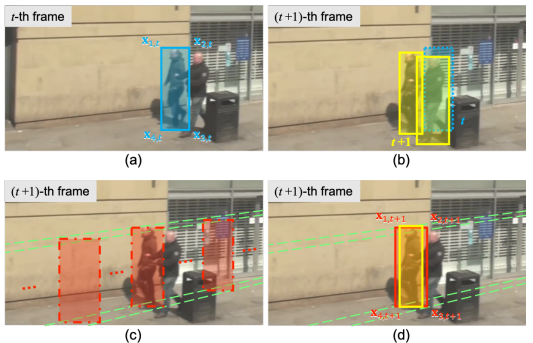
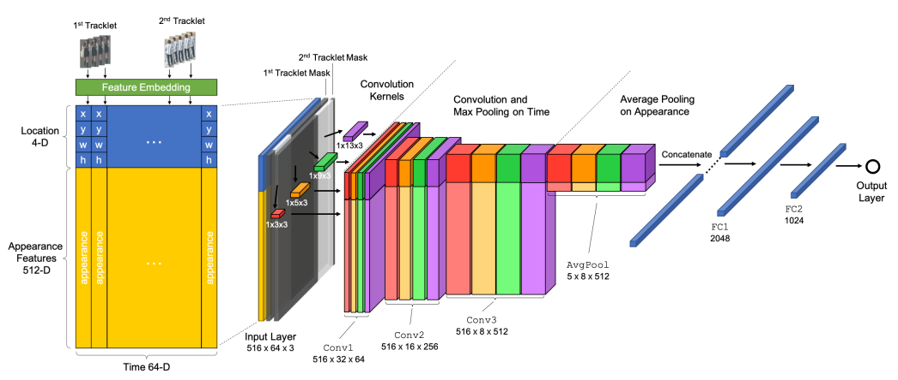

# Exploit the Connectivity: Multi-Object Tracking with TrackletNet

**Paper Reading Note**

URL: [https://arxiv.org/abs/1811.07258](https://arxiv.org/abs/1811.07258)

## TL;DR
   - 提出TrackletNet计算不同tracklet之间的相似度
   - 提出EG-IOU优化相机运动带来的错误匹配
   - 在构建的图模型中寻找全局最低cost的切分 线性差值补全tracklet

## Tracklet Graph Model
   - Vertex：使用检测结果中的高阈值数据生成可靠tracklet
   - Edge：任意边的$cost=\log(\frac{1-p_e}{p_e})$，其中其中$p_e$指这两个tracklet的相似度
   - 子图划分：使用贪婪匹配进行聚类划分，采用赋值 合并 拆分 交换和切断操作
   - $O=\min_{\pi\in\{\pm1\}}\sum\pi(u,w)c(u,w)$，使得每个子图cost最低的划分就是得到的tracklet

## Proposed TrackletNet Tracker

### Tracklet Generation with Epipolar Constraints

1. EG-IOU
   - 假设上一帧的检测结果保持尺寸不变，在下一帧沿极线(epipolar lines)方向平移
   - 对极几何中的基本矩阵F利用RANSAC算法迭代求解
   - $ f = ||size_t-size_{t+1}||_2^2+\sum ||x_t^TFx_{t+1}||_2^2 $，前者保持尺寸尽量不变，后者要求沿极线平移
2. FaceNet：appearance相似度用现成的模型计算

### Multi-Scale TrackletNet

1. 看图说话 (时间轴长度固定)
   - (location 4 + appearance 512) \* time 64 \* (feature + mask1 + mask2)
   - 将tracklet1从0开始填 tracklet2填入对应间隔时间 tracklet1～tracklet2中间线性差值 tracklet2～end补零
   - 添加对应的两个mask来明确两个tracklet所在的时间

## Thoughts
1. 512维的特征天然可以用transformer对应的tgt feature来代替，但trackletNet还是太大了；
2. 在密集人流场景下的EG-IOU很容易匹配到错误的对象，或许可以把appearance也融到匹配中(越来越复杂了)。