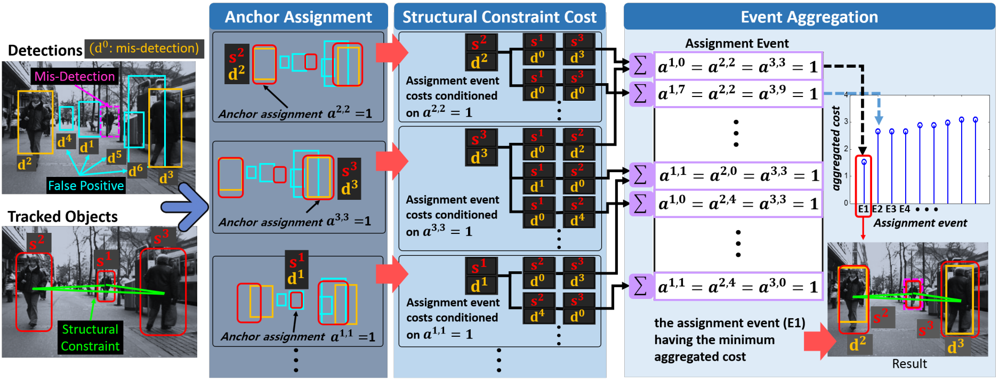
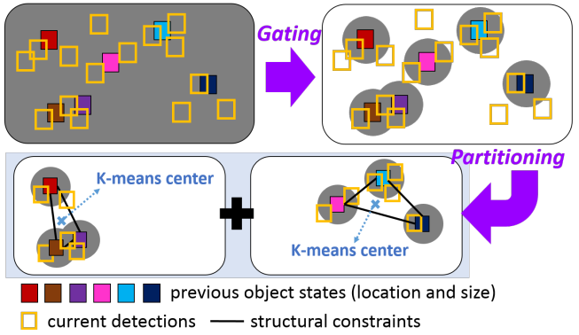

# Online Multi-Object Tracking via Structural Constraint Event Aggregation

**Paper Reading Note**

URL: [https://ieeexplore.ieee.org/document/7780524/](https://ieeexplore.ieee.org/document/7780524/)

## TL;DR
通过锚点寻找最低cost匹配，允许对检测的结果进行调整，可以生成假想框以解决FN问题。

## Structural constraint cost function

1. 相似性计算
   - 尺寸$ F_s(i,j) = -\ln(1-\frac{|h_i-h_j|}{2(h_i+h_j)}-\frac{|w_i-w_j|}{2(w_i+w_j)}) $
   - 特征$ F_a(i,j)=-\ln\sum_{b=1}^B\sqrt{(p_i^bp_j^b)} $
   - 位置$ F_c(i,j) = -\ln(\frac{area_i\cap area_j}{area_i\cup area_j}) $，在ij被选定为匹配时Fc自然为0，注意area要根据锚定的结果平移
2. cost计算 $ C=\sum a^{i,j}(F_s(i,j)+F_a(i,j)+F_c(i,j)) $，其中若和mis-match匹配则得分为预设的超参
3. 把当前帧的检测结果选一个和上一帧进行匹配，然后利用相对位置计算其他结果的匹配并获得一组cost，其中最低的cost就是当前帧的结果，因此可以根据结构信息推断出漏检位置的anchor

## Event aggregation

1. 最终结果$ \hat A = \min_A(C/\sum a^{i,j})$,迫使cost尽可能低且匹配到mismatch的anchor尽可能少
2. 在对象数量多的情况下遍历全部的匹配是不现实的
   - Gating: $ ||p^i-p^j ||<\sqrt{w_i^2+h_i^2}$和$ \exp(-F_s(i,j))>\tau_s $
   - Partitioning: 通过K-means对候选框进行聚类后构建结构信息

## Two-Step Online MOT via SCEA
1. 利用SCEA算法将当前帧的检测结果和track-let进行匹配
2. 恢复漏检对象
   - $ \gamma = \max(1/||[x^{i,j},v^{i,j}]||)$，即和上一帧结果在位置和速度上都尽可能没有变化
   - $ area_\gamma = [x_i,v_i,w_i,h_i] + [x_\gamma,v_\gamma, 0,0] \rightarrow F_c(\gamma,j)$,以差值和上一帧结果作为锚点计算其他匹配的cost
3. 卡尔曼滤波器平滑轨迹并更新结构信息
4. 若某个检测的size和appearance和其他检测都差别很大则认为是新的对象，连续多帧未检测到则认为停止

## Thoughts
1. 相当于额外输出了bbox的速度信息，结构+速度信息推断下一帧的结构信息，尝试根据结构在对应位置进行匹配检测结果，如果mismatch就尝试补充bbox结果。