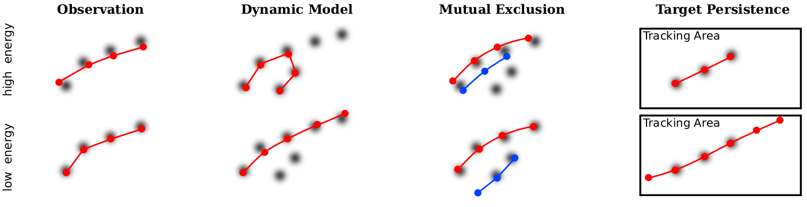
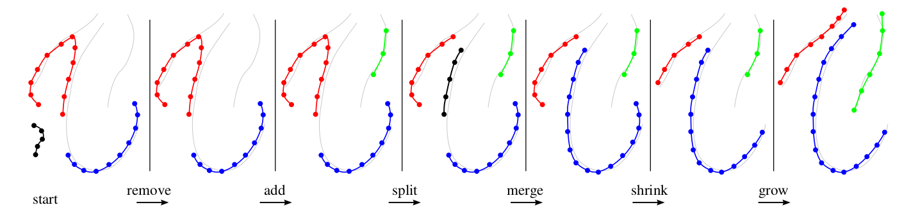

# Multi-target Tracking by Continuous Energy Minimization

**Paper Reading Note**

URL: [https://ieeexplore.ieee.org/document/5995311](https://ieeexplore.ieee.org/document/5995311)

## TL;DR
在拥有检测结果后针对tracklet进行优化，使得构造的能量尽可能低。注意跟踪结果并不和检测结果绑定，尽管是遮挡情况仍然会考虑其坐标，也即会进行bbox坐标调整、插帧等方式优化结果。

## Energy
 
1. Observation
   - track-let的物体应该和检测结果的IOU尽可能的大
   - 给出和当前帧物体数量相关的惩罚项以抑制FP的数量
   - $$ \sum_{t=1}^F\sum_{i=1}^N (\lambda+\sum_{g=1}^{D(t)}\frac{-c}{||x_i^t-d_g^t||^2+c}）$$
2. Dynamic
   - 使得每个对象在相邻帧的速度差值尽可能小（根据中心坐标计算）
   - $$ \sum_{t=1}^{F-2}\sum_{i=1}^N ||v_i^t-v_i^{t+1}||^2 $$
3. Mutual Exclusion
   - 两个物体不可能占据相同的空间 因此其中心坐标应尽可能大
   - $$ \sum_{i=1}^N \sum_{i\neq j} \frac{s_g^2}{||x_i^t-x_j^t||^2}$$
4. Target Persistence
   - 尽可能地扩展track-let使断点和图像边界尽可能接近
   - $$ \sum_{i=1}^N(Sigmiod(b(x_i^1)+Sigmiod(b(x_i^F))) $$
5. Regularization
   - 迫使track-let中的物体数量尽可能少 但每个物体存在的轨迹尽可能长
   - $$ N+\sum_{i=1}^N\frac{1}{len(i)} $$

## Minimization

1. Initialization
   - 使用EKF等简单跟踪器的结果作为迭代优化的初值以加快收敛
2. Adding and Removing
   - 移除整体Energy为正的track-let
   - 在未构成track-let的检测结果中生成新序列
3. Splitting and Merging
   - 如果能获得更低的能量层级 则将一个track-let拆分为两个
   - 尝试在没有detection结果的位置插帧以连接多个跟踪碎片
4. Growing and Shrinking
   - 如果没有对应的检测框 则收缩track-let的首尾 然后重新根据序列和检测结果进行头尾的插值

## Thoughts
1. 让输出的bbox两两之间的距离尽量远是否有利于优化Transformer的结果分布
2. 把track-let中速度发生大幅度改变的位置打断 沿速度方向移动结果并进行速度和IOU的双重匹配 如果没有可用匹配则假设结果保持速度平移出画面 