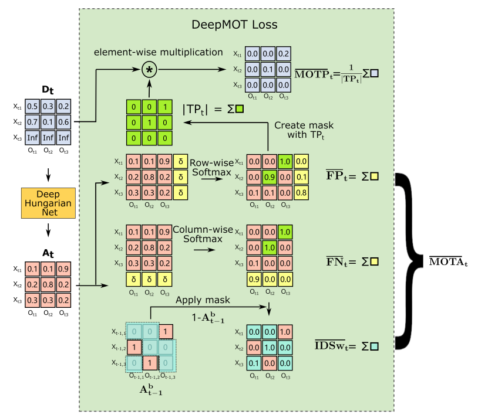

# DeepMOT: A Differentiable Framework for Training Multiple Object Trackers

**Paper Reading Note**

URL: [http://xavirema.eu/wp-content/papercite-data/pdf/Xu-2019.pdf](http://xavirema.eu/wp-content/papercite-data/pdf/Xu-2019.pdf)

## TL;DR
把MOTA和MOTP改写成可微的Loss，针对性地优化模型。

## DeepMOT Loss

0. 先跳过模型，假设已经得到了pred和gt的距离矩阵 $D_t$ 和软分配矩阵 $A_t$ ;
1. 按行/列加入超参 $\delta$ 以模拟对象进出视野，并由此计算FP(X匹不到真值O)和FN(真值O找不到)；
2. 上一帧的二值化软分配矩阵 $A_{t-1}^b$ 和当前帧结果 $A_t$ 进行对比，计算IDs的数量；
3. 当前帧结果 $A_{t}^b$ 求和即为TP，和距离矩阵 $D_t$ 元素乘后即可计算MOTP(和匹配到的距离负相关)；
4. $Loss = \frac{FN+FP+\gamma IDs}{M}+\lambda MOTP$ , 其中M为gt数量， $\gamma$ 和 $\lambda$ 是超参数；
5. 先用虚拟的检测结果和真值训练DHN，不平衡二分类问题(0远多于1)，再固定DHN参数训练检测器。

## Thought
1. 原文使用seq2seq BiRNN模型作为DHN的骨干，这里也许可以直接用transformer代替：作者使用BiRNN的原因是在不固定对象数量的情况下待处理的矩阵尺寸一直在变化，DAN选择是预设一个最大的范围+补零。Transformer中已经有固定大小的Query，考虑直接用detection和tracking的query计算矩阵；
2. 尽管是针对MOTA进行优化的模型，但实际点数不是很高，这部分可能是由于base model采用的是单目标跟踪的GOTURN和SiamRPN所致[?]
