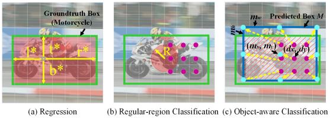

# Zhang, 2020, Ocean

*Object-aware Anchor-free Tracking*

## Forward

1. Anchor free模式，类似FCOS预测点到框四边的距离；
2. 增加了在线更新的分支，使用类似DiMP的梯度下降；
3. 引入特征对齐模块，以从预测的边界框中学习对象感知特征。

Feature combination
1. 通过11，12，21三种空洞卷积值获取不同形状感知野的信息。

Object-aware feature
1. (a)图tblr为回归分支学习内容 loss在整个GT取；
2. (b)图给出一个采样示例(紫色点)，只有红色区域内视为分类pr损失计算的区域；
3. (c)图红斜线部分是po分类损失计算的区域，青色点代表提取对象感知特征的采样位置，黄色箭头表示空间变换产生的偏移量；
   1. 分类map上的每一个点均在回归map上有一个对应的bbox预测，因此需要将这个bbox内的特征采样到分类map对应点上；
   2. 采用类似可变性卷积的方式，对预测bbox的特征进行卷积以获得对应点的分类特征。

On-line update
1. 只有两个特定的卷积层会被更新，目标是学习物体外观的变化以修正分类map；
2. 采用共轭梯度法(Conjugate Gradient and Gauss-Newton)。

## Backward

1. 坐标回归：在正样本范围内计算IoU Loss；
2. 分类损失：BCE Loss，在正样本范围内采样；
   1. po代表采样点预测框和真值的IoU；
   2. pr代表采样点到中心的距离是否超过阈值，也就是说仅考虑靠近物体中心的像素(文中为16个)。