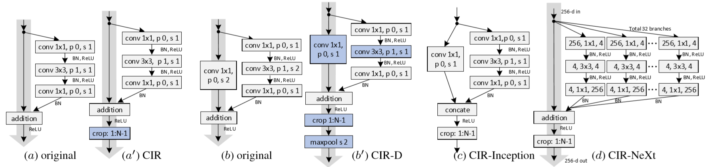
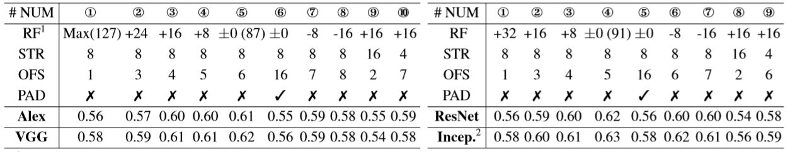

# Zhang, 2019, SiamDW

*Deeper and Wider Siamese Networks for Real-Time Visual Tracking*

## Forward
1. CIR Unit (cropping-inside residual)
   
   为解决padding带来的网络位置偏见，在原feature的基础上通过crop操作将外围的值去掉。
    ```Python
    def center_crop(x):
        return x[:, :, 1:-1, 1:-1].contiguous()
    ```

## Others
1. 对Siamese结构中Backbone结构的分析
   
   - 输出感受野(RF)大小覆盖输入样本图像约60％~80％时最佳；
      - 过大导致提取的特征对目标对象的空间位置不敏感，过小可能无法捕获对象的结构信息；
      - 特殊情况下最大RF超过了模板大小则性能会显著下降。
   - 网络步幅(STR)从4或8增加到16时，性能下降；
      - 过大的stride不利于跟踪任务的精确定位
   - 输出特征尺寸(OFS)过小也会导致缺乏对目标对象的足够空间结构描述；
   - Padding的加入使网络性能下降。
      - 处理模板：物体存在于模板的中央，因此所有特征均来自于图像；
      - 处理搜索区域：当物体处于区域边缘时特征将会包含padding区域，这会降低匹配相似度。
2. SiamDW模型设计
   - 应根据其与样本图像大小的比率来设置输出特征的感受野；
   - 按经验选取STR为4或8，OFS在5~7，应该综合考虑RF, STR和OFS来设计backbone结构；
   - Padding引起的位置偏差会降低Siamese跟踪器的准确性和鲁棒性，尤其是当目标物体快速移动或移动到图像边界时，模型需要去掉padding的影响(CIR)或是均衡采样训练样本(SiamRPN++)。

