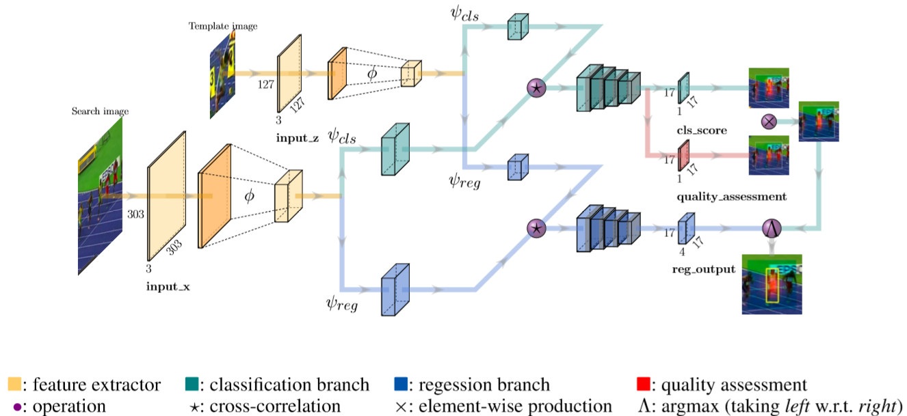

# Xu, 2020, SiamFC++

*Towards Robust and Accurate Visual Tracking with Target Estimation Guidelines*

## Forward

1. 绿色为SiamFC的输出，蓝色为anchor的估计，红色为新添加的跟踪质量得分。

## Backward
1. 训练标签
   - $$t,b,l,r$$代表响应位置$x_s,y_s$到gt bbox四边的距离；
       - $$  t = ([\dfrac{s}{2}]+y_s)-y_0,b = y_1-([\dfrac{s}{2}]+y_s),l = ([\dfrac{s}{2}]+x_s)-x_0,r = x_1-([\dfrac{s}{2}]+x_s)$$
       - s为步长，$$x_0,y_0$$为gt anchor左上顶点，$$x_1,y_1$$为gt右下顶点。
   - $$ L_{cls}:\{0, 1\} $$；
   - $$ L_{quality} $$：假设目标中心周围的像素比其他位置具有更好的估计质量；
      - $$ PSS = \sqrt{\dfrac{min(l,r)}{max(l,r)}\times\dfrac{min(t,b)}{max(t,b)}} $$
      > Thus we hypothesize that feature pixels around the center of objects will have a better estimation quality than others.
   - $$ L_{reg}:(t,b,l,r)$$。

2. 总体$$ Loss(p,q,t) = \dfrac{1}{N_{pos}}(\sum_{x,y}L_{cls}+\lambda_1\sum_{c_{x,y}>0}L_{quality}+\lambda_2\sum_{c_{x,y}>0}L_{reg}) $$
   - $$ L_{cls} $$：输出全图，focal loss；
   - $$ L_{quality} $$：仅对gt置信度大于0的区域，binary cross entropy loss；
   - $$ L_{reg} $$：仅对gt置信度大于0的区域，IoU loss。

## Others
1. 设计准则
   - 将跟踪任务拆解为分类(将前景和背景进行分离)和状态估计(输出bbox)两部分；
   - 分类器的输出应该是目标在当前位置的置信度；
   - 取消长宽比这类先验知识以加强泛化性能；
   - 将分类置信度直接用于边界框选择会导致性能下降，应该使用独立于分类的质量得分。