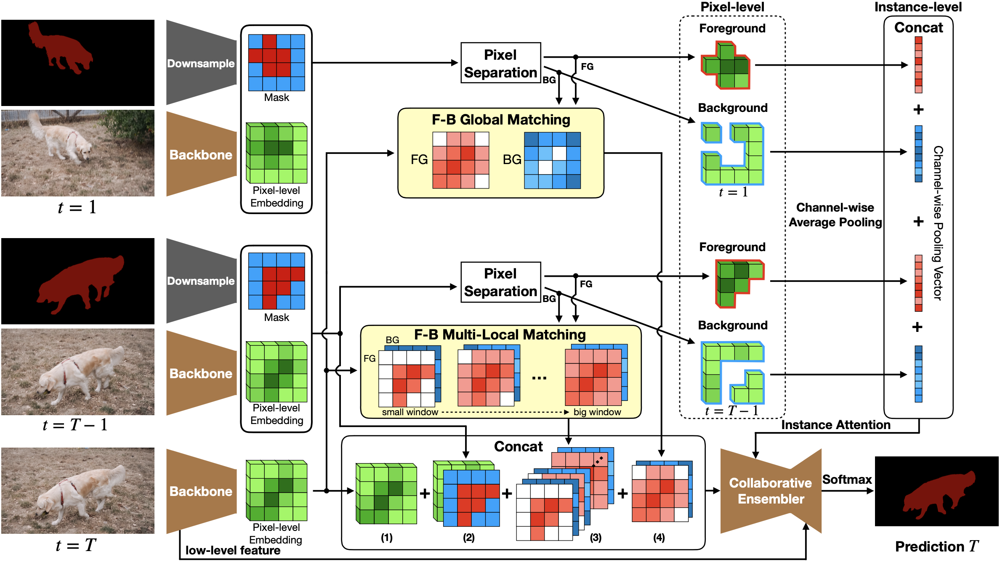

# Yang, 2020, CFBI

*(Not finished yet)*

*Collaborative Video Object Segmentation by Foreground-Background Integration*

- 同时预测前景和背景以消除噪声

## Forward

- 根据第一帧和上一帧的分割结果进行预测；
- 分割结果通过降采样获取前景和背景的mask，从而将由图片获取的特征进行分离；
- 分离的特征经过channel-wise的均值生成实例attention送入collaborative ensembler；
- 当前帧的特征较低level的特征被送入collaborative ensembler；
- 当前帧经过上一帧分割结果、增强后和多尺寸匹配、第一帧参数也送入collaborative ensembler。

1. Collaborative Pixel-level Matching
   1. 定义距离 $$ D_t(p,q) = 1-2/(1+exp(||e_p-e_q||^2-learnable\_bias)) $$
   2. 
   
2. Collaborative Instance-level Attention
3. Collaborative Ensembler