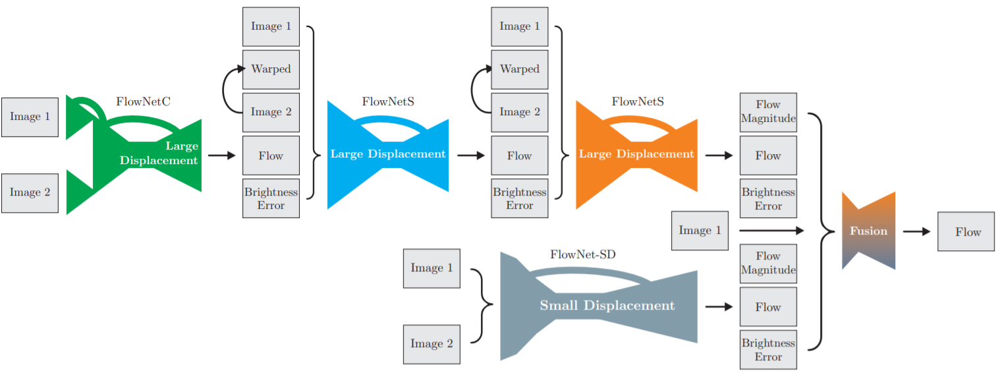

# Dosovitskiy, 2015, FlowNet

## V1 
*FlowNet: Learning Optical Flow with Convolutional Networks*

1. 模型结构
   
   - Simple：两张图片Cat在一起进CNN；
   - Corr：各自提取Feature后做Corr操作
     
     - $ c(x_1,x_2) = \sum_D\sum_i<f_1(x_1+i),f_2(x_2+i)>$，其中$ i\in [-k,k]\times[-k,k]$
     - 对map2上任意一个vec，取map1上范围D(文中D=41，stride=2)，做向量内积得441通道数；
     - 通过redir部分将key image的特征cat到后面。
   - 通过refinement进行上采样恢复feature分辨率
2. Refinement Module
   
   - 类似decoder结构，通过反卷积逐层叠加(cat)更高分辨率特征；
   - 每层结果均输出一个低分辨率的光流预测，上采样后同样cat到下一层(文中未提及中间监督问题)；
   - 作者对比了更多层的refine结果，并没有较大提升，考虑到计算量的问题最后采用了线性上采样。
3. Flying Chairs
   
   - 考虑到没有足够的含光流真值的数据集可供训练，作者模拟了一个数据集。

## V2
*FlowNet 2.0: Evolution of Optical Flow Estimation with Deep Networks*

1. 模型结构
   
   - FlowNetC：FlowNetV1的模型； 
   - FlowNetS：Cat了Image1，Flow-warped image2，Flow和Error，FlowNetC无法处理这个结构；
   - FlowNet-SD：将encoder部分7x7或5x5卷积改为多层的3x3卷积并取消步长以增加对小位移的分辨率。
   - Fusion：包含两者的预测，预测的Error和预测结果的channelnorm(?平均)，做encoder-decoder。

2. Things3D

   
   
   
   - 在Flying Chairs的基础上添加了3D模拟的光流数据集；
   - 小位移情况下的FlowNet-SD较好，大位移情况下FlowNet-CSS更好。