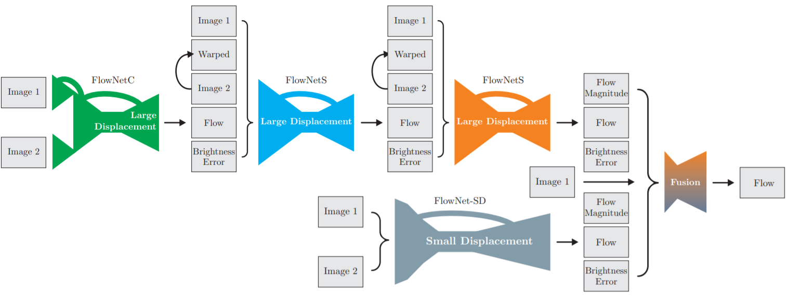
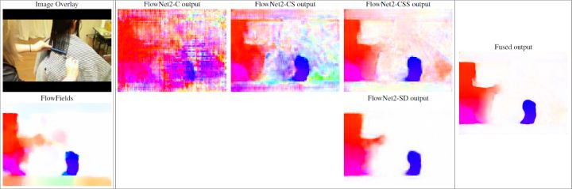
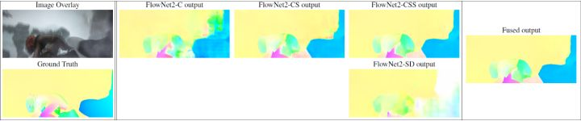

# Ilg, 2017, FlowNetV2

*FlowNet 2.0: Evolution of Optical Flow Estimation with Deep Networks*

## Forward
1. 模型结构
   
   - FlowNetC：FlowNetV1的模型； 
   - FlowNetS：Cat了Image1，Flow-warped image2，Flow和Error，FlowNetC无法处理这个结构；
   - FlowNet-SD：将encoder部分7x7或5x5卷积改为多层的3x3卷积并取消步长以增加对小位移的分辨率。
   - Fusion：包含两者的预测，预测的Error和预测结果的channelnorm(?平均)，做encoder-decoder。

## Backward
1. Things3D
   
   
   - 在Flying Chairs的基础上添加了3D模拟的光流数据集；
   - 小位移情况下的FlowNet-SD较好，大位移情况下FlowNet-CSS更好。