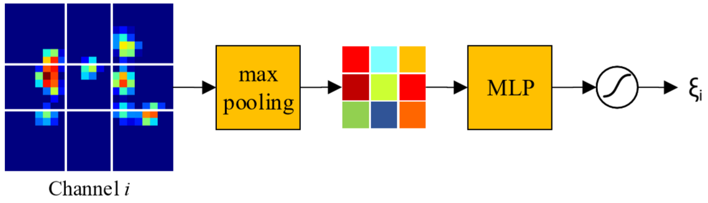
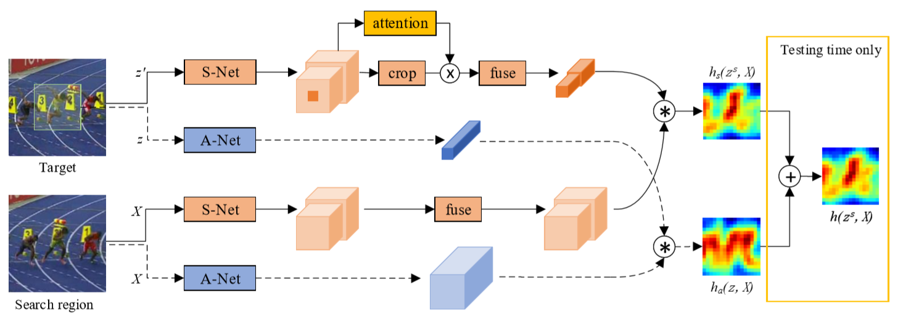

# He, 2018, SA-Siam

*A Two fold Siamese Network for Real-Time Object Tracking*

## Pre-processing
1.	Template z: 127×127×3, Extension zs: 255×255×3, Image x: 255×255×3;
2.	高级语义特征对目标的外观变化具有鲁棒性，有助于跟踪器的性能；
   - 不同物体所提取出来的特征在高层激活的通道不同, 目标周围的环境也很重要, 因此使用zs;
   > In order to do so,not only the target is relevant, the surrounding context of the target also matters. Therefore, in our proposed attention module, the input is the feature map of zs instead of z.  

   - 对任意通道, 不均衡地最大池化到3×3并送入两层MLP, 经Sigmoid后得到重要性得分;
    

   - 训练时每次均重新计算, 推断时仅计算第一帧Template得分并固定attention.
```Python
class AttentionNet(nn.Module):
    def __init__(self, pooling_interval):
        nn.Module.__init__(self)
        self.attention_pooling = self.unbalanced_pooling(pooling_interval)
        self.attention_fc = nn.Sequential(
            nn.Linear(9, 9), nn.ReLU(inplace=True),
            nn.Linear(9, 1), nn.Sigmoid())

    @staticmethod
    def unbalanced_pooling(interval):
        def pooling(x):
            max_pool = nn.AdaptiveMaxPool2d(1)
            x1 = max_pool(x[:, :, 0:interval, 0:interval])
            x2 = max_pool(x[:, :, interval:-interval, 0:interval])
            x3 = max_pool(x[:, :, -interval:, 0:interval])
            x4 = max_pool(x[:, :, 0:interval, interval:-interval])
            x5 = max_pool(x[:, :, interval:-interval, interval:-interval])
            x6 = max_pool(x[:, :, -interval:, interval:-interval])
            x7 = max_pool(x[:, :, 0:interval, -interval:])
            x8 = max_pool(x[:, :, interval:-interval, -interval:])
            x9 = max_pool(x[:, :, -interval:, -interval:])
            return torch.cat((x1, x2, x3, x4, x5, x6, x7, x8, x9), dim=-2)

        return pooling

    def forward(self, feature):
        pool = self.attention_pooling(feature).squeeze_(-1)
        return self.attention_fc(pool).unsqueeze_(-1)
```

## Forward

1. S-Net部分使用zs和X经过backbone(AlexNet)后的conv-4和conv-5特征；
   - backbone(zs)/backbone(x): 24×24×384+22×22×256;
   - zs为z拓展, 因此仅中间区域有效, 需要crop, 同时使用attention对不同通道加以区分；
   - 处理后的特征经fuse(conv: 1×1)后, 进行互相关计算, 得到hs(zs, x): 17×17×1；
```Python
class SNet(nn.Module):
    def __init__(self, zs):
        nn.Module.__init__(self)
        self.backbone = AlexNetConv45()
        
        zs_conv_4, zs_conv_5 = self.backbone(zs)
        self.attention_net_4 = AttentionNet(8)
        self.attention_net_5 = AttentionNet(9)
        self.attention_4 = self.attention_net_4(zs_conv_4)
        self.attention_5 = self.attention_net_5(zs_conv_5)

        self.fuse_4 = nn.Conv2d(384, 128, 1)
        self.fuse_5 = nn.Conv2d(256, 128, 1)

        self.adjust_conv = nn.Conv2d(1, 1, 1)

    def forward(self, zs, x, mode="train"):
        zs_conv_4, zs_conv_5 = self.backbone(zs)
        if mode == "train":
            self.attention_4 = self.attention_net_4(zs_conv_4)
            self.attention_5 = self.attention_net_5(zs_conv_5)
        zs_conv_4_crop = zs_conv_4[:, :, 8:-8, 8:-8]
        zs_conv_5_crop = zs_conv_5[:, :, 8:-8, 8:-8]
        zs_feat_4 = self.fuse_4(zs_conv_4_crop * self.attention_4)
        zs_feat_5 = self.fuse_5(zs_conv_5_crop * self.attention_5)

        x_conv_4, x_conv_5 = self.backbone(x)
        x_feat_4 = self.fuse_4(x_conv_4)
        x_feat_5 = self.fuse_5(x_conv_5)

        score = xcorr(x_feat_4, zs_feat_4) + xcorr(x_feat_5, zs_feat_5)
        return self.adjust_conv(score)
```
2. A-Net部分就是一个SiameseFC(z, x)；
3. S-Net和A-Net的结果加权相加即得到最终的score map.

## Backward
1. S-Net和A-Net单独训练, 防止由于score_map相加带来的loss抵消{score_map相乘是否有影响}；
2. 没有fine-tuning S-Net中的AlexNet而是直接拿A-Net中的参数来用;

    > Although fine-tuning S-Net may improve the tracking performance of the semantic branch alone, the overall performance could be unfavorably impacted. We have carried out experiments to verify this design choice, although we do not include them in this paper due to space limitation. 

3.	在17×17的图上使用交叉熵计算Loss.

## Post-processing
1. 使用了和SiameseFC相同的尺度池调整跟踪框尺寸的方法.
