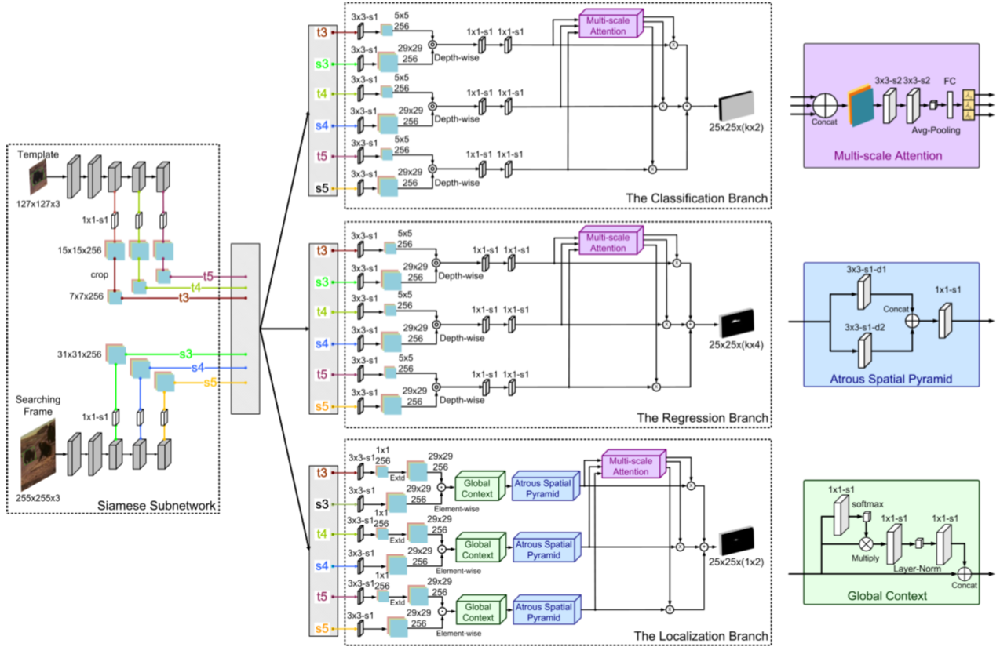

# Zhou, 2020, SiamMan

*Siamese Motion-aware Network for Visual Tracking*

## Forward

1. Backbone是ResNet50，为了解决padding在Template中带来的问题，在1x1conv后对其进行了crop；
2. 划分了三个子分支，将多重特征分别经不共享权重的3x3-s1后做depth-wise xcorr 再做后续处理；
   - Classification Branch & Regression Branch：常规RPN方法；
   - Localization Branch：对物体进行粗略地定位以解决快速运动物体带来的定位不准；
   - Block
     - Multi-scale Attention：cat在一起，卷积调整，池化，全连接出权重；
     - Atrous Spatial Pyramid：atrous就是dilation，把值为1和2的结果cat在一起调整结果；
     - Global Context：计算feature上关键位置并加强。

## Backward
1. Classification和Localization用交叉熵，Regression用的L1。