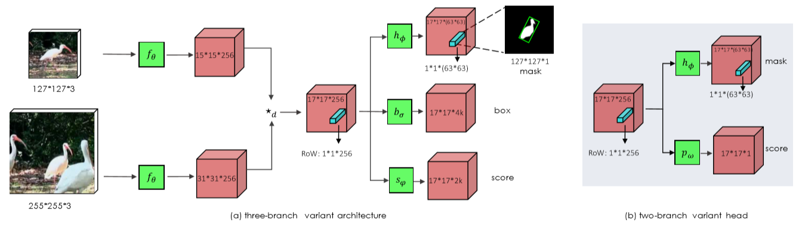
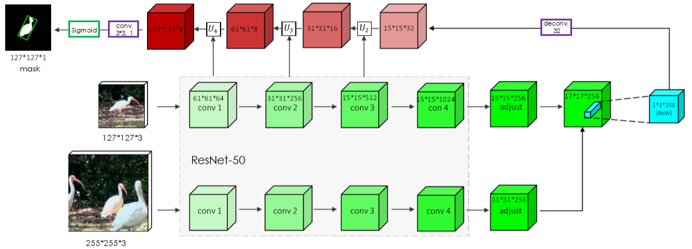
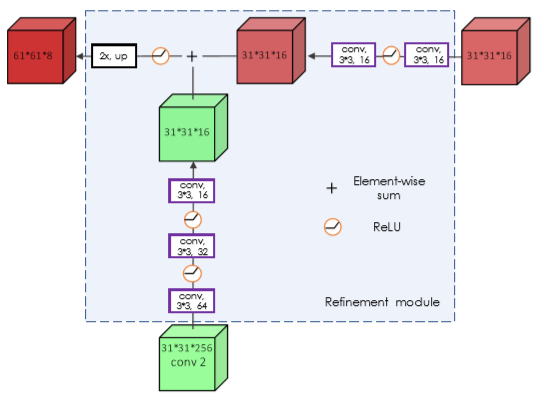

# Wang, 2019, SiamMask

*Fast Online Object Tracking and Segmentation: A Unifying Approach*

## Forward
1. 在SiameseRPN++的基础上添加了额外的head以预测mask
   
   - 直接预测效果不佳，作者先计算一个编码了RoW特征的vector，再将vector转化为对应区域的mask
   - RoW, response of a candidate window, 候选窗的响应
    ```Python
   def forward(self, template, search):
       template_feature = self.feature_extractor(template)
       search_feature = self.feature_extractor(search)
       corr_feature = xcorr_depthwise(template_feature, search_feature)
       # (b, 2*k + 4*k, w, h)
       rpn_pred_cls, rpn_pred_loc = self.rpn(corr_feature)
       # (b, 63*63, w, h) 
       rpn_pred_mask = self.mask(corr_feature)
       ...
    ```
2. Refinement module
   
   - 以ResNet50作为Backbone的情况下，用以完善mask的结构如图所示
   - 可以仅对RPN网络最终得到的anchor做refine操作以减少计算量
    ```Python
   def forward(self, template, search):
       features, template_feature = self.feature_extractor(template)
       _, search_feature = self.feature_extractor(search)
       corr_feature = xcorr_depthwise(template_feature, search_feature)
       rpn_pred_cls, rpn_pred_loc = self.rpn(corr_feature)
       rpn_pred_mask = self.mask(corr_feature, features)
       ...
    ```
3. Refine结构中的“残差”设计
   
   
   - 类似hourglass的结构，将新的特征和原有的特征经卷积调整后累加送入下一层
    ```Python
    def mask(self, corr_feature, features):
        # h-horizontal, v-vertical
        out = self.deconv(p3)
        out = self.post0(f.upsample(self.h2(out) + self.v2(p2), size=(31, 31)))
        out = self.post1(f.upsample(self.h1(out) + self.v1(p1), size=(61, 61)))
        out = self.post2(f.upsample(self.h0(out) + self.v0(p0), size=(127, 127)))
        out = out.view(-1, 127*127)
        return out
    ```
## Backward
1. 对所有RoW有$$ Loss_{mask} = \sum_n\dfrac{1+gt}{2wh}\sum_{D}log(1+exp(-gt*pred)) $$，因此所有gt=-1的位置其mask部分的loss值均为0，也即不参与训练；
2. mask，sim或score和box部分的损失函数线性加权。

## Others
1. 高效的在线学习算法：Siamese类的跟踪方案无法解决困难样本(如比赛中的两个运动员)，多是靠高斯窗加以抑制，但KCF相关的算法进行实时的模板学习解决这个问题，也许可以尝试进行模板替换和防止跟踪偏移。

   例如用encoder-decoder结构强迫网络记忆细节，然后forward之后检查key vector和模板的相似度，超过阈值就直接替换，但肯定是不能用SGD这类的训练方法来做在线学习(因为要使用大网络)，具体还没想好；

2. 精确输出表达：除了mask，也可以输出关键点/极点/位姿，也许可以往3D上靠。
