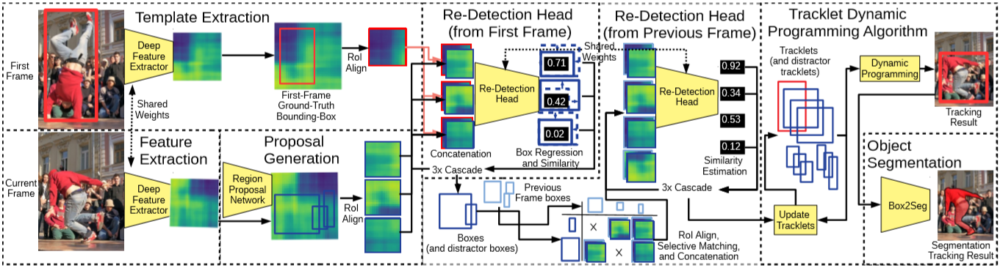
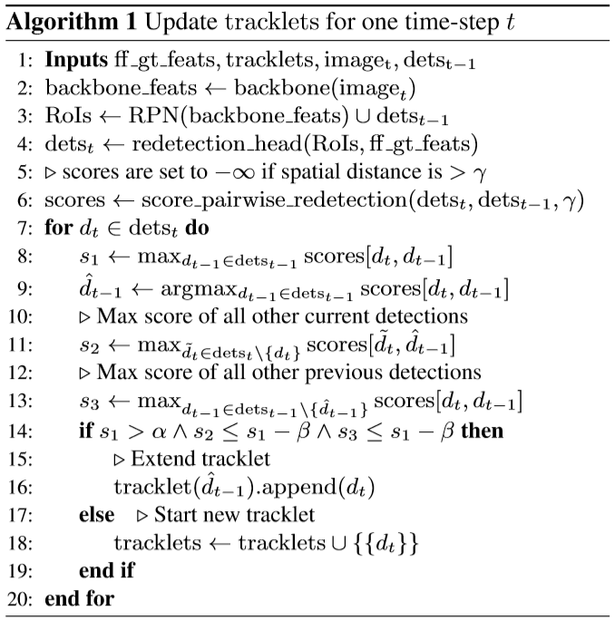

# Voigtlaender, 2019, SiamR-CNN

*SiamR-CNN: Visual Tracking by Re-Detection*

## Forward

1. 模型处理流程
   - 根据feature划分RoI，align后和第一帧的模板特征cat在一起做Re-Detection调整anchor计算得分；
     - 每次计算re-detection均根据级联结构迭代回归；
     - 和第一帧first-frame(ff)进行re-detection运算时同时获取box的$$x,y,w,h$$值以及相似度。
   - 得到的bbox和上一帧的结果进行可重复配对(仅筛除过远的box对)并做Re-Detection计算相似度；
      - 和上一帧track结果做匹配时不再修改box参数而仅仅进行相似度计算。
   - 跟踪目标包含跟踪目标和强干扰项，TDPA选取目标结果送Box2Seg(DeepLabV3+)可以得到分割结果。

2. Tracklet更新算法

   

   - 提取backbone特征，得到RPN结果后，加入上一帧检测结果以消除FN的影响；
   - 将Roi送入redetection head结合gt得到检测结果$$des_t$$，包括相似性和目标框；
   - 将当前帧与上一帧检测结果送入redetection head计算相似性得分，为了减少计算，仅把当前帧与上一帧框的空间距离小于$$\gamma$$时才送入head，否则设为负无穷；
   - 扩展tracklets，current det加入tracklet需要满足：
     - s1: 当前检测框和上一帧检测框最高相似度得分(连续两帧相似性得分高)；
     - s2: 上一帧最相似框和当前帧最高相似度得分(本帧没有其他检测与上一帧高度相似)；
     - s3: 当前检测框和上一帧检测框第二高相似度得分(上一帧没有其他检测与本帧有相仿的相似度)；
     - 如果s1超过阈值且比s2和s3均高出一截则加入对应序列，否则作为新的检测框创建新序列。

3. 整体得分计算(The total score of a track)
   
   一个跟踪序列由多个时间上不重叠的子序列(tracklet)构成：
   
   - $$ unary(a_i) =\sum_{start}^{end}{w_{ff} ff\_score(a_i,t)+(1-w_{ff}) ff\_tracklet\_score(a_i,t)} $$
     - $$ff\_score$$指和第一帧的gt进行re-detection的得分；
     - $$ff\_tracklet\_score$$指和第一帧的gt所在tracklet的最后一帧进行re-detection的得分。
- $$ loc\_socre(a_i,a_j) = -|end\_bbox(a_i)-start_bbox(a_j)|_1 $$
      - 指连续的tracklet(由于遮挡等原因而中断)间$$x,y,w,h$$的L1距离。
  
4. Tracklet Dynamic Programming Algorithm (TDPA)
   同时跟踪所有潜在的目标物体，包括distractor objects。TDPA 保持了一组 tracklets，包含start time,  end time和detections，每个detection都包含bounding box, re-dection score和RoI-aligned features。
   
   整个跟踪过程中会维护一个序列$$  \theta[a] $$，里面包含了从第一帧到第a个trakclet的整体得分，在每次track更新时，仅更新对应let的$\theta$值为$unary(a)+w_{loc}loc_{score}(a,\widetilde{a})+max(\theta[a])$，其中$\widetilde{a}$为上一个tracklet。
   
   在输出结果时，将会选择$argmax_a\theta[a]$作为输出，若此时对应的tracklet不在本帧则意味着丢失物体。

## Backward
1. 使用在coco上预训练的一个标准Faster R-CNN网络作为参数基础，训练的时候Backbone和RPN冻结；
2. 新的负样本采样方法
   - 传统 Faster RCNN: 用 RPN 来采样得到negative examples(数量不足);
   - Embedding Network: PReMVOS使用batch-hard triplet loss先在coco的各个类别上进行训练，然后再在YouTube-VOS上进行fine-tuning，从而将gt bbox 中的物体映射为 embedding vector;
   - Index Structure: 构建索引结构来寻找在embedding spqce中的最近邻；
   - 随机选择 video 和 object，然后随机选择 reference 和 target frame，检索 10000 个最近邻 reference box 并从中随机抽取100 个作为 negative training examples。