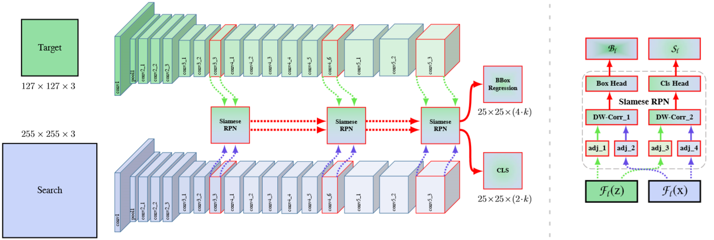
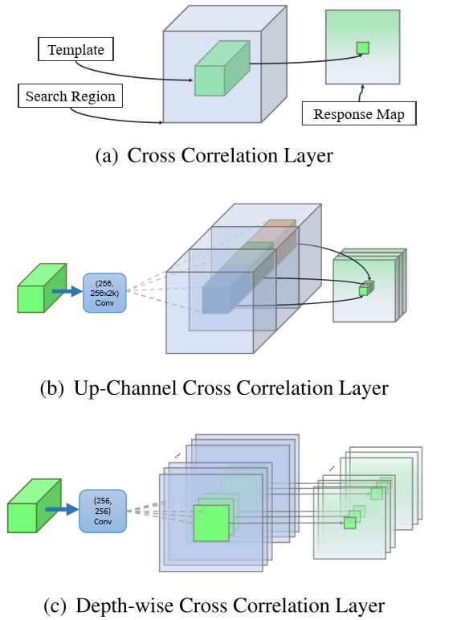

# Li, 2019, SiamRPN++

*SiamRPN++: Evolution of Siamese Visual Tracking with Very Deep Networks*

## Forward


1. 采用了更深的网络(ResNet50)作为特征提取网络；
2. 采用了多层融合的方式得出结果，其中融合使用的是线性加权；
3. 新的xcorr计算方法以加速网络。
   
   
    ```Python
    def xcorr_depthwise(feature, kernel):
        kernel_b, kernel_c, kernel_w, kernel_h = kernel.size()
        _, _, feature_w, feature_h = feature.size()

        kernel = kernel.view(-1, 1, kernel_w, kernel_h)
        feature = feature.view(1, -1, feature_w, feature_h)
        out = f.conv2d(feature, kernel, groups=kernel_b * kernel_c)
        return out.view(kernel_b, -1, out.size(2), out.size(3))
    ```

## Others
1. 注意到SiameseFC简约框架下的两个特性：
   - 平移不变性：$$ f(z, x[\delta\tau_j]) = f(z,x)[\delta\tau_j] $$
   - 网络对称性：$$ f(z, x') = f(x',z) $$

2. 为了保证深度网络具有适当/整齐的分辨率，ResNet网络中具有padding操作，也就不具备严格的平移不变性，padding的引入会使得网络输出的响应对不同位置有了不同的认知。而我们进行进一步的训练是希望网络学习到如何通过物体的表观特征来分辨回归物体，这就限制了深网络在tracking领域的应用;

3. 考虑到SiamRPN++的意义不再是进行相似度计算，而是通过计算回归的偏移量和分类的分数来选择最终的目标，这使网络可以不再具有对称性，因此引入了Depthwise Cross Correlation。