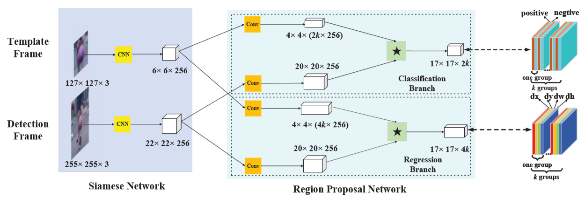

# Li, 2018, SiamRPN

*High Performance Visual Tracking with Siamese Region Proposal Network*

## Forward

1. SiameseFC部分输出的特征分别送到两个不同的CNN模块中以获得RPN网络所需的张量;
2. RPN网络分为k个b-box, 因此输出为cls: 17×17×2k(前景/背景), reg: 17×17×4k(dx/dy/dw/dh);
   - $$ A^{cls} = (x, y) : (c^{pos}, c^{neg}) * k, A^{reg} = (x, y) : (dx, dy, dw, dh) * k $$
   - $$ x^{pro} = x^{an} + dx * w^{an}, y^{pro} = y^{an} + dy * h^{an} $$
   - $$ w^{pro} = w^{an} * exp(dw), h^{pro} = h^{an} * exp(dh) $$
3. 通过NMS算法输出检测框. 

## Backward
1. 对任意点(x,y), 均输出$$(c_{pos}, c_{neg}, dx, dy, dw, dh)$$, 根据forward公式计算得对应框的位置和大小后与真值计算IOU，超过0.6为正样本，小于0.3为负样本;
2. 总$$ Loss = Loss_{cls} + \lambda Loss_{reg}$$, 在正负样本中均衡采样进行训练.
   - cls-loss: 交叉熵损失函数;
   - reg-loss: 设$$ A_{x,y,w,h} 和 T_{x,y,w,h}$$ 分别为预测值和真值, 有 $$ \delta[0, 1] = \dfrac{T_{x,y} - A_{x,y}}{ A_{w,h}}, \delta[2, 3] = ln\dfrac{T_{w,h}}{ A_{w,h}}$$.
   采用 $$ smooth_{L1}(x, \sigma) = \left\{\begin{aligned} 0.5\sigma^2x^2, |x|<\dfrac{1}{\sigma^2}\\|x| - \dfrac{1}{2\sigma^2}, |x|>=\dfrac{1}{\sigma^2}\end{aligned}\right.$$, 可得 $$ Loss_{reg} = \sum_{i=0}^3smooth_{L1}(\delta[i], \sigma)$$.
