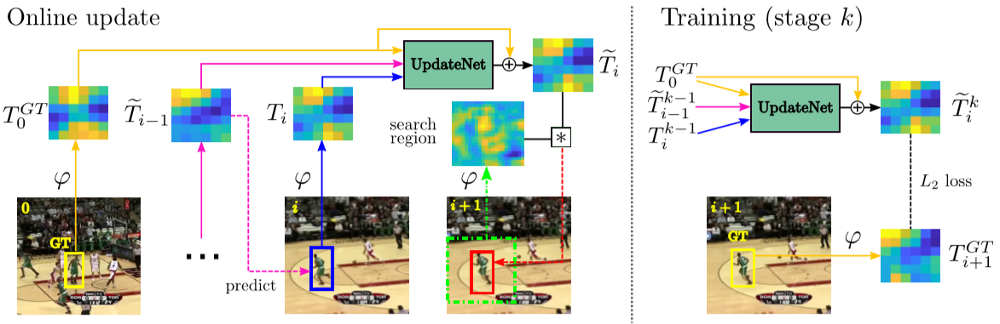

# Zhang, 2019, UpdateNet

*Learning the Model Update for Siamese Trackers*

## Forward

1. 本文提出了一种全新的在线模板学习方法，将同时使用第一帧的GT，上一帧累计的模板和当前帧检测结果的模板共同参与UpdateNet以获取当前帧的累计模板；

2. UpdateNet结构
   
    > UpdateNet is a two-layer convolutional neural network: one 1×1×3C×96 convolutional layer, followed by a ReLU and a second convolutional layer of dimensions 1×1×96×C. 

   将三部分的特征concatenate在一起，压缩到96通道再复原到原通道数。
   
   跟踪任务对速度的要求比较高，基于SGD的在线更新肯定是不可取的，UpdateNet相当于用简单的网络去拟合线性更新过程中的最佳加权参数。

## Backward
1. 训练的过程中并没有较好的累积模板，因此分为两阶段训练，第一阶段使用线性更新原则并将每一帧的模板保存在硬盘中。之后使用保存的结果训练UpdateNet，最后再放开限制进行fine-tuning。